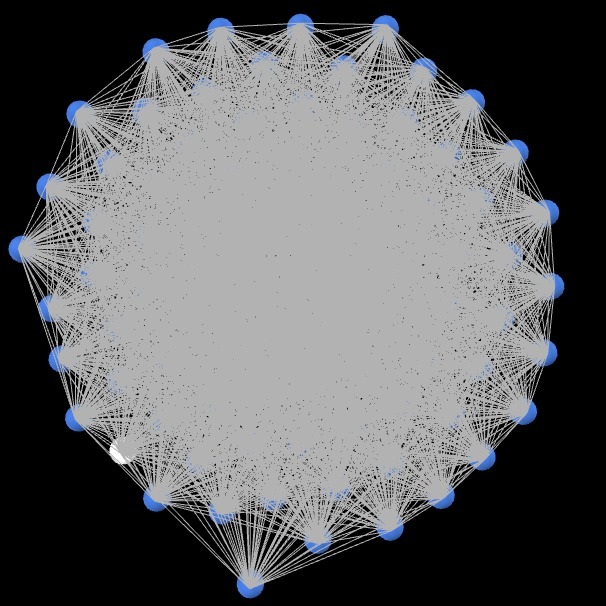

```{r setup, include=FALSE, warning=FALSE}
r = getOption("repos")
r["CRAN"] = "http://cran.us.r-project.org"
r["CRAN"] = "https://CRAN.R-project.org/package=d3Tree"
options(repos = r)

#install.packages("devtools")
#library(devtools)
#install_github("d3treeR/d3treeR")

if(!"readxl" %in% installed.packages()) {install.packages("readxl")}
library(readxl)

if(!"tidyr" %in% installed.packages()) {install.packages("tidyr")}
if(!"visNetwork" %in% installed.packages()) {install.packages("visNetwork")}
if(!"shiny" %in% installed.packages()) {install.packages("shiny")}
if(!"igraph" %in% installed.packages()) {install.packages("igraph")}
if(!"waffle" %in% installed.packages()) {install.packages("waffle")}
if(!"gridExtra" %in% installed.packages()) {install.packages("gridExtra")}
if(!"grid" %in% installed.packages()) {install.packages("grid")}
if(!"ggplot2" %in% installed.packages()) {install.packages("ggplot2")}
if(!"ggthemes" %in% installed.packages()) {install.packages("ggthemes")}
if(!"ggExtra" %in% installed.packages()) {install.packages("ggExtra")}
if(!"psych" %in% installed.packages()) {install.packages("psych")}
if(!"reshape2" %in% installed.packages()) {install.packages("reshape2")}
if(!"scales" %in% installed.packages()) {install.packages("scales")}
if(!"ggalt" %in% installed.packages()) {install.packages("ggalt")}
if(!"dplyr" %in% installed.packages()) {install.packages("dplyr")}
if(!"plyr" %in% installed.packages()) {install.packages("plyr")}
if(!"RColorBrewer" %in% installed.packages()) {install.packages("RColorBrewer")}
if(!"gdata" %in% installed.packages()) {install.packages("gdata")}
if(!"treemap" %in% installed.packages()) {install.packages("treemap")}
if(!"devtools" %in% installed.packages()) {install.packages("devtools")}
if(!"rsconnect" %in% installed.packages()) {install.packages("rsconnect")}
if(!"NetworkInference"%in%installed.packages()){install.packages("NetworkInference")}
if(!"tibble" %in% installed.packages()){install.packages("tibble")}
if(!"gridBase" %in% installed.packages()){install.packages("gridBase")}
#if(!"d3treeR" %in% installed.packages()) {install.packages("d3treeR")}
if(!"data.table" %in% installed.packages()){install.packages("data.table")}
if(!"igraph" %in% installed.packages()){install.packages("igraph")}


#library(devtools)
#{devtools::install_github("timelyportfolio/d3treeR")}
library(rsconnect)
library(NetworkInference)
library(tibble)
library(gridBase)
library(psych)
library(reshape2)
library(tidyr)
library(scales)
library(ggalt)
library(dplyr)
library(plyr)
library(gdata)
library(RColorBrewer)
library(treemap)
library(ggExtra)
library(ggthemes)
library(ggplot2)
library(grid)
library(gridExtra)
#library(d3treeR)
library(waffle)
library(igraph)
library(shiny)
library(visNetwork)
library(data.table)
library(knitr)
```

## 1.Objective

In any organization, building relationships among members is considered a way to improve interpersonal relations. When taking into account social activities for members, it can be an added competitive advantage to identify people's preferences and seek a common ground for their interactions.

A platform that gathers information about the social activities of individuals, for example, a leisure app, can be used to tailor an organization's team building exercises and events.

For this analysis, a leisure app has been identified as a good platform on which to strengthen social relationships among individuals in an organization. Organization here is taken to mean any organized group of people with a particular purpose.


## 2.Data Gathering and Processing

*Idea:* _MBD O1-GroupF_ as a Big Data consulting company was approached by IE to identify the best way to leverage networking among HST students. "Students are always coding and studying so we need to help them strengthen their social bounds for them to have a better professional future."

_MBD O1-GroupF_ came out with and innovative disrupting solution based in Social Network Analysis: *NET-IE*. 


```{r net ie, echo=FALSE, fig.align='center',include = TRUE, fig.cap="Net IE Logo", out.width = '75%'}
path <- getwd()
image <- paste(path,"Net-IE.jpg",sep="/")

#knitr::include_graphics("/Users/louisdubaere/Documents/IE/Term 2/Social Network Analysis/sna/Net-IE.jpg")
```

NET-IE is an interactive social analysis tool that thoroughly analyzes the IE Student Network, identifying key insights for networking optimization. _MBD O1-GroupF_ was capable of understanding key network properties such as centrality measures, transitivity, reciprocity, community detection and information diffusion. 

The following document explains each step taken for the creation of the tool, as well as the main insights and conclusions. 


### 2.1.Data Gathering

A survey was conducted to understand the leisure activities of master students at IE University. The leisure activities that were considered fall into three categories:

* Music
* Sports
* Movie

The structure of the survey was as follows:
Each applicant would select at most 3 genres of movies, music, and sport.
Each applicant would provide at most 3 names of their favourite movies, music artists, and sports players.

Other information collected from the survey:

* Email address -- used as a unique identifier for each applicant.
* Academic program -- name of the program being taken at IE.
* Country of birth -- used to categorize individuals based on country & region.
* Movies, music, and sports preferences.
* Names of top 3 favourite movies, top 3 musicians, and top 3 athletes.

Overall, a total of 85 responses were collected and this was used to conduct a social network analysis of IE students.


### 2.2.Data processing

In the resulting network, the students are represented as nodes and the leisure shared interests are represented as edges. Depending on the type and number of shared interests, the edges will have different weights as stated in the following table.

```{r, fig.align='center', echo = FALSE}
# Table: weights for edge construction
image <- paste(path,"weights.jpg",sep="/")

```

In general terms, a commonality of two students regarding to music genre, sport, or movie genre, adds 5 points to the weight of the connection. If both of the students share Top of Mind (TOM) for a specific Artist, Athlete or Movie, 10 points are added to the weight, and if they just consider a specific Artist, Athlete or Movie (without being TOM), 7 points are added to the connection weight.

```{r echo=FALSE, results='hide',message=FALSE, warning=FALSE}
data <- read.csv('Leisure_clean_final_raw.csv', sep = ",")
```

```{r, fig.align='center', echo = FALSE, include=FALSE}

######################################################################################
######################################################################################
######################################################################################

######################################################################################
######################################################################################
######################################################################################

Program_weight = vector()
from = vector()
to = vector()

for (first in 1:nrow(data)){
  for (second in 1:nrow(data)){
    condition1 <- (data[first,c('Academic.Program')] == data[second,c('Academic.Program')] &
                     data[first,c('Academic.Program')] != "")

    if (first > second){
      from <- append(from, first)
      to <- append(to, second)
      Program_weight <- append(Program_weight, sum(condition1)*3) 
      #3 points if involved in same program
    }
  }
}

######################################################################################
######################################################################################
######################################################################################
Country_weight = vector()

for (first in 1:nrow(data)){
  for (second in 1:nrow(data)){
    condition <- (data[first,c('Country.of.Birth')] == data[second,c('Country.of.Birth')]& 
                    data[first,c('Country.of.Birth')] != "")
    if (first > second){
      Country_weight <- append(Country_weight, sum(condition)*2) 
      #2 points if same country of birth
    }
  }
}

######################################################################################
######################################################################################
######################################################################################
Region_weight = vector()

for (first in 1:nrow(data)){
  for (second in 1:nrow(data)){
    condition <- (data[first,c('Region')] == data[second,c('Region')]& 
                    data[first,c('Region')] != "")
    if (first > second){
      Region_weight <- append(Region_weight, sum(condition)) 
      #1 point if same region
    }
  }
}

######################################################################################
######################################################################################
######################################################################################

# 5 points for each match in music genre

Music_Genre_weight = vector()

for (first in 1:nrow(data)){
  for (second in 1:nrow(data)){
    condition1 <- (data[first,c('Music.Genre0')] == data[second,c('Music.Genre0')]& 
                     data[first,c('Music.Genre0')] != "")
    condition2 <- (data[first,c('Music.Genre0')] == data[second,c('Music.Genre1')]& 
                     data[first,c('Music.Genre0')] != "") 
    condition3 <- (data[first,c('Music.Genre0')] == data[second,c('Music.Genre2')]& 
                     data[first,c('Music.Genre0')] != "")
    condition4 <- (data[first,c('Music.Genre1')] == data[second,c('Music.Genre0')]& 
                     data[first,c('Music.Genre1')] != "")
    condition5 <- (data[first,c('Music.Genre1')] == data[second,c('Music.Genre1')]& 
                     data[first,c('Music.Genre1')] != "")
    condition6 <- (data[first,c('Music.Genre1')] == data[second,c('Music.Genre2')]& 
                     data[first,c('Music.Genre1')] != "")
    condition7 <- (data[first,c('Music.Genre2')] == data[second,c('Music.Genre0')]& 
                     data[first,c('Music.Genre2')] != "")
    condition8 <- (data[first,c('Music.Genre2')] == data[second,c('Music.Genre1')]& 
                     data[first,c('Music.Genre2')] != "")
    condition9 <- (data[first,c('Music.Genre2')] == data[second,c('Music.Genre2')]& 
                     data[first,c('Music.Genre2')] != "")
    
    if (first > second){
      Music_Genre_weight <- append(Music_Genre_weight, sum(condition1,condition2,condition3,condition4                                            ,condition5,condition6,condition7,condition8,condition9)*5)
    }
  }
}

######################################################################################
######################################################################################
######################################################################################
Artist_weight = vector()

for (first in 1:nrow(data)){
  for (second in 1:nrow(data)){
    condition1 <- (data[first,c('Artist0')] == data[second,c('Artist0')]& 
                     data[first,c('Artist0')] != "")
    condition2 <- (data[first,c('Artist0')] == data[second,c('Artist1')]& 
                     data[first,c('Artist0')] != "") 
    condition3 <- (data[first,c('Artist0')] == data[second,c('Artist2')]& 
                     data[first,c('Artist0')] != "")
    condition4 <- (data[first,c('Artist1')] == data[second,c('Artist0')]& 
                     data[first,c('Artist1')] != "")
    condition5 <- (data[first,c('Artist1')] == data[second,c('Artist1')]& 
                     data[first,c('Artist1')] != "")
    condition6 <- (data[first,c('Artist1')] == data[second,c('Artist2')]& 
                     data[first,c('Artist1')] != "")
    condition7 <- (data[first,c('Artist2')] == data[second,c('Artist0')]& 
                     data[first,c('Artist2')] != "")
    condition8 <- (data[first,c('Artist2')] == data[second,c('Artist1')]& 
                     data[first,c('Artist2')] != "")
    condition9 <- (data[first,c('Artist2')] == data[second,c('Artist2')]& 
                     data[first,c('Artist2')] != "")
    
    ranking_weight <- 0
    if (condition1){
      ranking_weight <- ranking_weight + 10 
      #10 points for Top of Mind match (adding 1 more below)
    }else if (condition5){
      ranking_weight <- ranking_weight + 0
    }else if (condition9){
      ranking_weight <- ranking_weight + 0
    }
    
    if (first > second){
      Artist_weight <- append(Artist_weight, ranking_weight + sum(condition2,condition3,condition4,condition5,condition6,condition7,condition8,condition9)*7)
    }
  }
}

######################################################################################
######################################################################################
######################################################################################
Sport_Genre_weight = vector()

for (first in 1:nrow(data)){
  for (second in 1:nrow(data)){
    condition1 <- (data[first,c('Sport0')] == data[second,c('Sport0')]& 
                     data[first,c('Sport0')] != "")
    condition2 <- (data[first,c('Sport0')] == data[second,c('Sport1')]& 
                     data[first,c('Sport0')] != "") 
    condition3 <- (data[first,c('Sport0')] == data[second,c('Sport2')]& 
                     data[first,c('Sport0')] != "")
    condition4 <- (data[first,c('Sport1')] == data[second,c('Sport0')]& 
                     data[first,c('Sport1')] != "")
    condition5 <- (data[first,c('Sport1')] == data[second,c('Sport1')]& 
                     data[first,c('Sport1')] != "")
    condition6 <- (data[first,c('Sport1')] == data[second,c('Sport2')]& 
                     data[first,c('Sport1')] != "")
    condition7 <- (data[first,c('Sport2')] == data[second,c('Sport0')]& 
                     data[first,c('Sport2')] != "")
    condition8 <- (data[first,c('Sport2')] == data[second,c('Sport1')]& 
                     data[first,c('Sport2')] != "")
    condition9 <- (data[first,c('Sport2')] == data[second,c('Sport2')]& 
                     data[first,c('Sport2')] != "")
    
    if (first > second){
      Sport_Genre_weight <- append(Sport_Genre_weight, sum(condition1,condition2,condition3,condition4
                                                ,condition5,condition6,condition7,condition8,condition9)*5)
    }
  }
}

######################################################################################
######################################################################################
######################################################################################
Athlete_weight = vector()

for (first in 1:nrow(data)){
  for (second in 1:nrow(data)){
    condition1 <- (data[first,c('Athlete0')] == data[second,c('Athlete0')]& 
                     data[first,c('Athlete0')] != "")
    condition2 <- (data[first,c('Athlete0')] == data[second,c('Athlete1')]& 
                     data[first,c('Athlete0')] != "") 
    condition3 <- (data[first,c('Athlete0')] == data[second,c('Athlete2')]& 
                     data[first,c('Athlete0')] != "")
    condition4 <- (data[first,c('Athlete1')] == data[second,c('Athlete0')]& 
                     data[first,c('Athlete1')] != "")
    condition5 <- (data[first,c('Athlete1')] == data[second,c('Athlete1')]& 
                     data[first,c('Athlete1')] != "")
    condition6 <- (data[first,c('Athlete1')] == data[second,c('Athlete2')]& 
                     data[first,c('Athlete1')] != "")
    condition7 <- (data[first,c('Athlete2')] == data[second,c('Athlete0')]& 
                     data[first,c('Athlete2')] != "")
    condition8 <- (data[first,c('Athlete2')] == data[second,c('Athlete1')]& 
                     data[first,c('Athlete2')] != "")
    condition9 <- (data[first,c('Athlete2')] == data[second,c('Athlete2')]& 
                     data[first,c('Athlete2')] != "")
    
    ranking_weight <- 0
    if (condition1){
      ranking_weight <- ranking_weight + 10
    }else if (condition5){
      ranking_weight <- ranking_weight + 0
    }else if (condition9){
      ranking_weight <- ranking_weight + 0
    }
    
    if (first > second){
      Athlete_weight <- append(Athlete_weight, ranking_weight + sum(condition2,condition3
                                  ,condition4,condition5,condition6,condition7,condition8,condition9) * 7)
    }
  }
}

######################################################################################
######################################################################################
######################################################################################
Movie_Genre_weight = vector()

for (first in 1:nrow(data)){
  for (second in 1:nrow(data)){
    condition1 <- (data[first,c('Movie.Genre0')] == data[second,c('Movie.Genre0')]& 
                     data[first,c('Movie.Genre0')] != "")
    condition2 <- (data[first,c('Movie.Genre0')] == data[second,c('Movie.Genre1')]& 
                     data[first,c('Movie.Genre0')] != "") 
    condition3 <- (data[first,c('Movie.Genre0')] == data[second,c('Movie.Genre2')]& 
                     data[first,c('Movie.Genre0')] != "")
    condition4 <- (data[first,c('Movie.Genre1')] == data[second,c('Movie.Genre0')]& 
                     data[first,c('Movie.Genre1')] != "")
    condition5 <- (data[first,c('Movie.Genre1')] == data[second,c('Movie.Genre1')]& 
                     data[first,c('Movie.Genre1')] != "")
    condition6 <- (data[first,c('Movie.Genre1')] == data[second,c('Movie.Genre2')]& 
                     data[first,c('Movie.Genre1')] != "")
    condition7 <- (data[first,c('Movie.Genre2')] == data[second,c('Movie.Genre0')]& 
                     data[first,c('Movie.Genre2')] != "")
    condition8 <- (data[first,c('Movie.Genre2')] == data[second,c('Movie.Genre1')]& 
                     data[first,c('Movie.Genre2')] != "")
    condition9 <- (data[first,c('Movie.Genre2')] == data[second,c('Movie.Genre2')]& 
                     data[first,c('Movie.Genre2')] != "")
    
    if (first > second){
      Movie_Genre_weight <- append(Movie_Genre_weight, sum(condition1,condition2,condition3,condition4
                                                ,condition5,condition6,condition7,condition8,condition9)*5)
    }
  }
}

######################################################################################
######################################################################################
######################################################################################
Movie_weight = vector()

for (first in 1:nrow(data)){
  for (second in 1:nrow(data)){
    condition1 <- (data[first,c('Movie0')] == data[second,c('Movie0')]& 
                     data[first,c('Movie0')] != "")
    condition2 <- (data[first,c('Movie0')] == data[second,c('Movie1')]& 
                     data[first,c('Movie0')] != "") 
    condition3 <- (data[first,c('Movie0')] == data[second,c('Movie2')]& 
                     data[first,c('Movie0')] != "")
    condition4 <- (data[first,c('Movie1')] == data[second,c('Movie0')]& 
                     data[first,c('Movie1')] != "")
    condition5 <- (data[first,c('Movie1')] == data[second,c('Movie1')]& 
                    data[first,c('Movie1')] != "")
    condition6 <- (data[first,c('Movie1')] == data[second,c('Movie2')]& 
                     data[first,c('Movie1')] != "")
    condition7 <- (data[first,c('Movie2')] == data[second,c('Movie0')]& 
                     data[first,c('Movie2')] != "")
    condition8 <- (data[first,c('Movie2')] == data[second,c('Movie1')]& 
                     data[first,c('Movie2')] != "")
    condition9 <- (data[first,c('Movie2')] == data[second,c('Movie2')]& 
                     data[first,c('Movie2')] != "")
    
    ranking_weight <- 0
    if (condition1){
      ranking_weight <- ranking_weight + 10
    }else if (condition5){
      ranking_weight <- ranking_weight + 0
    }else if (condition9){
      ranking_weight <- ranking_weight + 0
    }
    
    if (first > second){
      Movie_weight <- append(Movie_weight, ranking_weight + sum(condition1,condition2,condition3,condition4
                                      ,condition5,condition6,condition7,condition8,condition9) * 7)
    }
  }
}

######################################################################################
######################################################################################
######################################################################################

leisure_edges <- data.frame(from)
leisure_edges <- cbind(leisure_edges,to)
leisure_edges <- cbind(leisure_edges,Program_weight)
leisure_edges <- cbind(leisure_edges,Country_weight)
leisure_edges <- cbind(leisure_edges,Region_weight)
leisure_edges <- cbind(leisure_edges,Music_Genre_weight)
leisure_edges <- cbind(leisure_edges,Artist_weight)
leisure_edges <- cbind(leisure_edges,Sport_Genre_weight)
leisure_edges <- cbind(leisure_edges,Athlete_weight)
leisure_edges <- cbind(leisure_edges,Movie_Genre_weight)
leisure_edges <- cbind(leisure_edges,Movie_weight)

#Exclude Academic and Country for total weight
leisure_edges$Overall_weight <- rowSums(leisure_edges[,6:ncol(leisure_edges)])

#Remove connections of 0 aggregate weight
leisure_edges <-leisure_edges[leisure_edges$Overall_weight!=0, ] 
leisure_key <- data

head(leisure_edges)
head(leisure_key)

save(leisure_edges,file="leisure_edges.Rda")
save(leisure_key,file="leisure_key.Rda")

```

```{r, fig.align='center', echo = FALSE, include=FALSE, warning=FALSE}
df <- read.csv('Leisure_clean_final_raw.csv', sep = ",")
```


## 3.Data Exploration and Analysis


### 3.1.OVERALL DISTRIBUTION OF PREFERENCES

The interactive tree map below shows the distribution of IE students preferences concerning music, films and sports. Once a main preference category is selected, the relative amount of students preferring a specific sport or genre is represented by the size of box. Granularity by geographic region and gender can be accessed by clicking on the respective boxes.

```{r, fig.align='center', echo = FALSE, include=FALSE, warning=FALSE}
############################################# TreeMap App ################################################## 
############################################################################################################
############################################################################################################ 
############################################################################################################ 

get_frequencies <- function(data_frame,category,percentage=TRUE) {
  if(category == 'Music') {
    list <- unlist(list(data_frame$Music.Genre0, data_frame$Music.Genre1, data_frame$Music.Genre2))
  }
  else if(category == 'Movies') {
    list <- unlist(list(data_frame$Movie.Genre0, data_frame$Movie.Genre1, data_frame$Movie.Genre2))
  }
  else if(category == 'Sports') {
    list <- unlist(list(data_frame$Sport0, data_frame$Sport1, data_frame$Sport2))
  }
  else {
    return("Error")
  }
  list <- list[list != ""]
  list <- as.data.frame(list)
  list <- count(list, 'list')
  if(percentage) {
    list$freq <- round((list$freq / sum(list$freq))*100)
  }
  colnames(list) <- c('name','freq')
  list<- list[order(list$freq, decreasing = T),]
  return(list)
}

df<-read.csv("Leisure_clean_final_raw.csv",header=TRUE,sep=",")
regions <- c('AFRICA','EUROPE','ASIAPAC','MIDDLE EAST','NORTH AMERICA','LATIN AMERICA')
genders <- c('M','F')
for(r in regions) {
  for(g in genders) {
    nam <- paste("df", r, g, sep = "_")
    assign(nam, df[df$Region == r & df$Gender == g,])
  }
}

for(c in c('Music','Movies','Sports')) {
  namm <- paste("fullList",c,sep="")
  assign(namm, data.frame()) 
  for (r in regions) {
    for(g in genders) {
      nam <- paste("df", r, g, sep = "_")
      df_temp <- get(nam)
      listName <- get_frequencies(df_temp,c,F)
      listName$region <- r
      listName$gender <- g
      assign(namm,rbind(get(namm),listName))
    }
  }
}

############################################################################################################ 
############################################################################################################ 
############################################################################################################

# Define UI for application that draws a histogram
ui <- fluidPage(
   
   # Application title
   titlePanel("Tree Map"),
   
   # Sidebar with a slider input for number of bins 
   sidebarLayout(
      sidebarPanel(
         selectInput("Category", "Select Category", c('Music','Movies','Sports')),
         selectInput("Gender", "Filter on Gender", c('All','Male','Female')),
         selectInput("Region", "Filter on Region", c('All','ASIAPAC','AFRICA','EUROPE','MIDDLE EAST','NORTH AMERICA','LATIN AMERICA')),
         width=3
      ),
      
      # Show a plot of the generated distribution
      mainPanel(
         d3tree3Output("treeMap",width = "110%",height="650px"),
         width= 8
      )
   )
)

############################################################################################################ 
############################################################################################################ 
############################################################################################################

server <- function(input, output) {
   # renderD3tree3
   output$treeMap <- renderD3tree3({
     #toUse <- df
     if(input$Category == 'Music') {
       listToUse <- fullListMusic
     }
     else if(input$Category == 'Movies') {
       listToUse <- fullListMovies
     }
     else if(input$Category == 'Sports') {
       listToUse <- fullListSports
     }
     toUse <- listToUse
     index_ <- c(colnames(toUse)[1],colnames(toUse)[3],colnames(toUse)[4])
     if(input$Gender != 'All') {
        gender <- input$Gender
        toUse <- toUse[toUse$gender == substr(gender,1,1),]
        index_ <- c(colnames(toUse)[1],colnames(toUse)[3])
      }
     if(input$Region != 'All') {
       toUse <- toUse[toUse$region == input$Region,]
       index_ <- c(colnames(toUse)[1],colnames(toUse)[4])
     }
     if(input$Gender != 'All' & input$Region != 'All') {
       index_ <- c(colnames(toUse)[1])
     } 
      p <- treemap(toUse,index=index_,vSize=colnames(toUse)[2],fontcolor.labels = "black")
      
      name1 <- paste("Category:", input$Category, "| Gender:", input$Gender, "| Region:", input$Region, sep= " ")
      d3tree3(p, rootname = name1, celltext = "name")
   })
}

shinyApp(ui = ui, server = server, options = list(height = 800, width = 1000))
```


### 3.2.DISTRIBUTION OF PREFERENCES BY GENDER

Following are three charts that compare preferences for music, film and sport between males \textcolor{steelblue}{males} and \textcolor{deeppink}{females}, where the blue dot represents the relative number of males, and the pink dot represents the relative number of females.

It's interesting to see how Males prefer Genres such as Rock and Electronic, while Females prefer Pop and Reggaeton.

Regarding movies, Males are more interested in Action and SciFi, while Females are more interested in Comedy and Romance.

For Sport preferences, Males prefer Football (Soccer) and Tennis while Females prefer Swimming and Skiing.


#### 3.2.1.MUSIC

```{r, fig.align='center', echo = FALSE, warning=FALSE}

reducedDF <- df[c(5,8,9,10)]
split <- split(reducedDF, reducedDF$Gender)

female<-as.data.frame(split$F)
genreF<-unlist(list(female$Music.Genre0,female$Music.Genre1,female$Music.Genre2))
genreF<-genreF[genreF !=""]
genreF<-as.data.frame(genreF)
genreF<-count(genreF, 'genreF')
colnames(genreF)[2]<-"freqF"
colnames(genreF)[1]<-"musicGenre"
genreF$freqFpc<-genreF$freqF/sum(genreF$freqF)

male<-as.data.frame(split$M)
genreM<-unlist(list(male$Music.Genre0,male$Music.Genre1,male$Music.Genre2))
genreM<-genreM[genreM !=""]
genreM<-as.data.frame(genreM)
genreM<-count(genreM, 'genreM')
colnames(genreM)[2]<-"freqM"
colnames(genreM)[1]<-"musicGenre"
genreM$freqMpc<-genreM$freqM/sum(genreM$freqM)

joinHist <- merge(x=genreM, y=genreF, by = 'musicGenre')
joinHistF<-joinHist[joinHist$freqFpc > joinHist$freqMpc,]
joinHistF <- joinHistF[order(joinHistF$freqFpc),]
joinHistF$musicGenre <- factor(joinHistF$musicGenre, levels=as.character(joinHistF$musicGenre)) 

g1 <- ggplot(joinHistF, aes(x=freqMpc, xend=freqFpc, y=musicGenre, group=musicGenre)) + 
  geom_dumbbell(colour="black", size=0.5, colour_x="steelblue", size_x = 3, size_xend = 3, colour_xend="deeppink",
                dot_guide=TRUE, dot_guide_size=0.5, dot_guide_colour = "grey") + 
                scale_x_continuous(label=percent) + 
                labs(x=NULL, y=NULL) + ggtitle("Female Dominated Music Genres") +
                theme_tufte()

joinHistM<-joinHist[joinHist$freqMpc > joinHist$freqFpc,]
joinHistM <- joinHistM[order(joinHistM$freqMpc),]
joinHistM$musicGenre <- factor(joinHistM$musicGenre, levels=as.character(joinHistM$musicGenre))

g2 <- ggplot(joinHistM, aes(x=freqMpc, xend=freqFpc, y=musicGenre, group=musicGenre)) + 
  geom_dumbbell(colour="black", size=0.5, colour_x="steelblue", size_x = 3, size_xend = 3, colour_xend="deeppink",
                dot_guide=TRUE, dot_guide_size=0.5, dot_guide_colour = "grey") + 
  scale_x_continuous(label=percent) + 
  labs(x=NULL, y=NULL) + ggtitle("Male Dominated Music Genres") +
  theme_tufte()

grid.arrange(g1,g2, ncol=2)
```


#### 3.2.2.MOVIES

```{r, fig.align='center', echo = FALSE, warning=FALSE}
reducedDF <- df[c(5,20,21,22)]
split <- split(reducedDF, reducedDF$Gender)

female<-as.data.frame(split$F)
genreF<-unlist(list(female$Movie.Genre0,female$Movie.Genre1,female$Movie.Genre2))
genreF<-genreF[genreF !=""]
genreF<-as.data.frame(genreF)
genreF<-count(genreF, 'genreF')
colnames(genreF)[2]<-"freqF"
colnames(genreF)[1]<-"movieGenre"
genreF$freqFpc<-genreF$freqF/sum(genreF$freqF)

male<-as.data.frame(split$M)
genreM<-unlist(list(male$Movie.Genre0,male$Movie.Genre1,male$Movie.Genre2))
genreM<-genreM[genreM !=""]
genreM<-as.data.frame(genreM)
genreM<-count(genreM, 'genreM')
colnames(genreM)[2]<-"freqM"
colnames(genreM)[1]<-"movieGenre"
genreM$freqMpc<-genreM$freqM/sum(genreM$freqM)

joinHist <- merge(x=genreM, y=genreF, by = 'movieGenre')

joinHistF<-joinHist[joinHist$freqFpc > joinHist$freqMpc,]
joinHistF <- joinHistF[order(joinHistF$freqFpc),]
joinHistF$movieGenre <- factor(joinHistF$movieGenre, levels=as.character(joinHistF$movieGenre)) 

g1 <- ggplot(joinHistF, aes(x=freqMpc, xend=freqFpc, y=movieGenre, group=movieGenre)) + 
  geom_dumbbell(colour="black", size=0.5, colour_x="steelblue", size_x = 3, size_xend = 3, colour_xend="deeppink",
                dot_guide=TRUE, dot_guide_size=0.5, dot_guide_colour = "grey") + 
  scale_x_continuous(label=percent) + 
  labs(x=NULL, y=NULL) + ggtitle("Female Dominated Film Genres") +
  theme_tufte()

joinHistM<-joinHist[joinHist$freqMpc > joinHist$freqFpc,]
joinHistM <- joinHistM[order(joinHistM$freqMpc),]
joinHistM$movieGenre <- factor(joinHistM$movieGenre, levels=as.character(joinHistM$movieGenre))

g2 <- ggplot(joinHistM, aes(x=freqMpc, xend=freqFpc, y=movieGenre, group=movieGenre)) + 
  geom_dumbbell(colour="black", size=0.5, colour_x="steelblue", size_x = 3, size_xend = 3, colour_xend="deeppink",
                dot_guide=TRUE, dot_guide_size=0.5, dot_guide_colour = "grey") + 
  scale_x_continuous(label=percent) + 
  labs(x=NULL, y=NULL) + ggtitle("Male Dominated Film Genres") +
  theme_tufte()

grid.arrange(g1,g2, ncol=2)
```


#### 3.2.3.SPORT

```{r, fig.align='center', echo = FALSE, warning=FALSE}
reducedDF <- df[c(5,14,15,16)]
split <- split(reducedDF, reducedDF$Gender)

female<-as.data.frame(split$F)
genreF<-unlist(list(female$Sport0,female$Sport1,female$Sport2))
genreF<-genreF[genreF !=""]
genreF<-as.data.frame(genreF)
genreF<-count(genreF, 'genreF')
colnames(genreF)[2]<-"freqF"
colnames(genreF)[1]<-"sportGenre"
genreF$freqFpc<-genreF$freqF/sum(genreF$freqF)

male<-as.data.frame(split$M)
genreM<-unlist(list(male$Sport0,male$Sport1,male$Sport2))
genreM<-genreM[genreM !=""]
genreM<-as.data.frame(genreM)
genreM<-count(genreM, 'genreM')
colnames(genreM)[2]<-"freqM"
colnames(genreM)[1]<-"sportGenre"
genreM$freqMpc<-genreM$freqM/sum(genreM$freqM)

joinHist <- merge(x=genreM, y=genreF, by = 'sportGenre')
joinHistF<-joinHist[joinHist$freqFpc > joinHist$freqMpc,]
joinHistF <- joinHistF[order(joinHistF$freqFpc),]
joinHistF$sportGenre <- factor(joinHistF$sportGenre, levels=as.character(joinHistF$sportGenre)) 

g1 <- ggplot(joinHistF, aes(x=freqMpc, xend=freqFpc, y=sportGenre, group=sportGenre)) + 
  geom_dumbbell(colour="black", size=0.5, colour_x="steelblue", size_x = 3, size_xend = 3, colour_xend="deeppink",
                dot_guide=TRUE, dot_guide_size=0.5, dot_guide_colour = "grey") + 
  scale_x_continuous(label=percent) + 
  labs(x=NULL, y=NULL) + ggtitle("Female Dominated Sport Types") +
  theme_tufte()

joinHistM<-joinHist[joinHist$freqMpc > joinHist$freqFpc,]
joinHistM <- joinHistM[order(joinHistM$freqMpc),]
joinHistM$sportGenre <- factor(joinHistM$sportGenre, levels=as.character(joinHistM$sportGenre))

g2 <- ggplot(joinHistM, aes(x=freqMpc, xend=freqFpc, y=sportGenre, group=sportGenre)) + 
  geom_dumbbell(colour="black", size=0.5, colour_x="steelblue", size_x = 3, size_xend = 3, colour_xend="deeppink",
                dot_guide=TRUE, dot_guide_size=0.5, dot_guide_colour = "grey") + 
  scale_x_continuous(label=percent) + 
  labs(x=NULL, y=NULL) + ggtitle("Male Dominated Sport Types") +
  theme_tufte()

grid.arrange(g1,g2, ncol=2)
```


### 3.3.Distribution by Geographic Region

The barcharts below display the geographic distribution of the three most popular music genres, three most popular movie genres, and three most popular sports.

```{r, fig.align='center', echo = FALSE, message=FALSE, warning=FALSE}
music<-read_xlsx("genres.xlsx",sheet = 1, col_names = TRUE)
data_music<- gather(music, music_type, Percent, -region)

ggplot(data_music , aes(music_type,Percent)) + 
  geom_bar(aes(fill = region), stat = "identity", position = "dodge")+ 
  scale_y_continuous(labels = scales::percent)+
  scale_y_continuous(labels = percent_format(accuracy = 2))+ 
  theme(panel.grid.major = element_blank(), 
        panel.grid.minor = element_blank(),
        panel.background = element_blank(), 
        axis.line = element_line(colour = "black"))+
  labs(title="Percentage of Top 3 Music Genre among Regions")+ 
  theme(legend.title = element_blank())+
  xlab("")

sport<-read_xlsx("genres.xlsx",sheet = 2, col_names=TRUE)

data_sport<- gather(sport, sport_type, Percent, -region)

ggplot(data_sport, aes(sport_type,Percent)) + 
  geom_bar(aes(fill = region), stat = "identity", position = "dodge")+ 
  scale_y_continuous(labels = scales::percent)+
  scale_y_continuous(labels = percent_format(accuracy = 2))+ 
  theme(panel.grid.major = element_blank(), 
        panel.grid.minor = element_blank(),
        panel.background = element_blank(), 
        axis.line = element_line(colour = "black"))+
  labs(title="Percentage of Top 3 Sports among Regions")+ 
  theme(legend.title = element_blank())+
  xlab("")

movie<-read_xlsx("genres.xlsx",sheet = 3, col_names = TRUE)

data_movie <- gather(movie, movie_type, Percent, -region)

ggplot(data_movie, aes(movie_type,Percent)) + 
  geom_bar(aes(fill = region), stat = "identity", position = "dodge")+ 
  scale_y_continuous(labels = scales::percent)+
  scale_y_continuous(labels = percent_format(accuracy = 2))+
  theme(panel.grid.major = element_blank(), 
        panel.grid.minor = element_blank(),
        panel.background = element_blank(), 
        axis.line = element_line(colour = "black"))+
  labs(title="Percentage of Top 3 Movie Type among Regions")+ 
  theme(legend.title = element_blank())+
  xlab("")

```


```{r, fig.align='center', echo = FALSE, warning=FALSE}
leisure_graph <- graph.data.frame(leisure_edges, vertices = leisure_key, directed = F)
```


## 4.General Graph Centrality Measures

### 4.1.Degree Distribution

#### 4.1.1Summary

The average degree centrality of the leisure network is 79.46. This means that on average, each person is directly connected to approximately 80 other people based on their preference for music, movies, and sports. With a maximum of three options for each leisure activity, the likelihood of a connection to another student is high which results in this high degree centrality.

```{r, fig.align='center', echo = FALSE, warning=FALSE}
dg_leisure<-degree(leisure_graph, mode='total')
dg_leisure_sd <- sd(dg_leisure)
summary(dg_leisure)

#scaled_leisure <- log10(dg_leisure)
#hist(scaled_leisure, main = "Scaled Undirected Leisure Histogram")
#dg_leisure_sd
```


#### 4.1.2Standard Deviation of Leisure Graph Degree

Several insights can be drawn from the standard deviations of this network. With regards to the student leisure preference network, the standard deviation is fairly smaller way smaller than the average. This implies that while the overall average is quite high at approximately 80, since paticipants can choose up to 3 options to each leaisure activities, all of us are directly connected to a bunch of people.

```{r, fig.align='center', echo = FALSE, warning=FALSE}
dg_leisure_sd
```


### 4.2.Network Properties

#### 4.2.1.Average Path Length and Network Diameter

The average path length describes the average distance between any two vertices. The network diameter describes the longest possible distance between two vertices in terms of the most efficient path. 
The average path length is 1.054 which shows a highly connected graph. Similarly, the diameter of the leisure network graph is 2. This suggests that the distance between two most unrelated students in terms of the leisure activities is still very small, which means that to get to the furthest person in the network, you need to only pass through 2 people.

```{r, fig.align='center', echo = FALSE, warning=FALSE}
leisure_mean <- mean_distance(leisure_graph, directed=F)
leisure_mean

bt_leisure <- betweenness(leisure_graph, directed = F)
cl_leisure <- closeness(leisure_graph, mode = "total", normalized = TRUE)

leisure_diamater <- diameter(leisure_graph, directed = F)
leisure_diamater

```


### 4.3.Clustering Coefficient

The clustering coefficient measures the transitivity of a network, that is how connected closed groups of vertices are with each other. The global clustering coefficient gives an indication of the overall clustering in the network, while the local clustering coefficient gives an indication of the embeddedness of single nodes.


#### 4.3.1.Global Transitivity

The global clustering coefficient for our leisure graph is about 0.952, which is extremely high.This suggests that our leisure network is very transitively connected.

```{r, fig.align='center', echo = FALSE, warning=FALSE}
leisure_globaL_coefficient <- transitivity(leisure_graph, type = "global")
leisure_globaL_coefficient
```


### 4.4.Top 20 degree centrality students

Degree centrality measures how many vertices connect to a single one.
```{r, fig.align='center', echo = FALSE, warning=FALSE}
sorted_degree <- sort(dg_leisure, decreasing = T)
top_20_students_by_degree <- names(sorted_degree[1:20])

table_label <- c("degree",
                 "Key")

centrality_top_20 <- data.frame(sorted_degree[1:20])
centrality_top_20$Key <- row.names(centrality_top_20)

names(centrality_top_20)<- table_label
centrality_top_20<-centrality_top_20[,c(ncol(centrality_top_20),1:(ncol(centrality_top_20)-1))]

centrality_top_20=merge(x = centrality_top_20, y = leisure_key, by = "Key", all.x = TRUE)
centrality_top_20$Email.address<-NULL
centrality_top_20<-centrality_top_20[ ,1:5]
centrality_top_20<-centrality_top_20[order(-centrality_top_20$degree), ]
centrality_top_20 <- centrality_top_20[c(1,3,5,4,2)]
colnames(centrality_top_20) <- c('Key','Name', 'Gender', 'Program','Degree')
knitr::kable(centrality_top_20, digits=0)
```


### 4.5.Top 20 Betweeness Students

Betweeness measures the average length of shortest paths that pass through a vertex. High betweeness can be understood as links between different closed clusters of students.
```{r, fig.align='center', echo = FALSE, warning=FALSE}
sorted_bt <- sort(bt_leisure, decreasing = T)
top_20_leisure_by_bt <- names(sorted_bt[1:20])


table_label1 <- c("Betweeness",
                  "Key")

Betweeness_top_20 <- data.frame(bt_leisure[top_20_leisure_by_bt])
Betweeness_top_20$Key <- row.names(Betweeness_top_20)

names(Betweeness_top_20)<- table_label1
Betweeness_top_20<-Betweeness_top_20[,c(ncol(Betweeness_top_20),1:(ncol(Betweeness_top_20)-1))]
Betweeness_top_20=merge(x = Betweeness_top_20, y = leisure_key, by = "Key", all.x = TRUE)
Betweeness_top_20$Email.address<-NULL
Betweeness_top_20<-Betweeness_top_20[ ,1:5]
Betweeness_top_20<-Betweeness_top_20[order(-Betweeness_top_20$Betweeness), ]
Betweeness_top_20 <- Betweeness_top_20[c(1,3,5,4,2)]
colnames(Betweeness_top_20) <- c('Key','Name', 'Gender', 'Program','Betweeness')
knitr::kable(Betweeness_top_20, digits=0)
```


### 4.6.Top 20 Closeness Students

Closeness centrality measures the average distance from any given vertex to all other vertices.
```{r, fig.align='center', echo = FALSE, warning=FALSE}
sorted_cl <- sort(cl_leisure, decreasing = T)
top_20_leisure_by_cl <- names(sorted_cl[1:20])

table_label2 <- c("Closeness",
                  "Key")

Closeness_top_20 <- data.frame(cl_leisure[top_20_leisure_by_cl])
Closeness_top_20$Key <- row.names(Closeness_top_20)

names(Closeness_top_20)<- table_label2
Closeness_top_20<-Closeness_top_20[,c(ncol(Closeness_top_20),1:(ncol(Closeness_top_20)-1))]
Closeness_top_20=merge(x = Closeness_top_20, y = leisure_key, by = "Key", all.x = TRUE)
Closeness_top_20$Email.address<-NULL
Closeness_top_20<-Closeness_top_20[ ,1:5]
Closeness_top_20<-Closeness_top_20[order(-Closeness_top_20$Closeness), ]
Closeness_top_20 <- Closeness_top_20[c(1,3,5,4,2)]
colnames(Closeness_top_20) <- c('Key','Name', 'Gender', 'Program','Closeness')
knitr::kable(Closeness_top_20, digits=2)
```

From the analysis above, the top 20 students of degree, betweeness and closeness centrality are pretty similar showing that those top students have chosen the most popular activities in terms of music, sports and movie, which leads them to have high degree, betweeness and closeness centrality at the same time.


## 5.Music Interest Analysis

```{r, fig.align='center', echo = FALSE, warning=FALSE}

# Subset the dataset to music only
leisure_edges_music <- leisure_edges[,c(1:7)]
leisure_edges_music$music_weight <- rowSums(leisure_edges[,6:7])
leisure_edges_music <-leisure_edges_music[leisure_edges_music$music_weight!=0, ]
leisure_edges_music <- leisure_edges_music[,c(1,2,8)]

leisure_key_music <- leisure_key[,c(1,2,3,8:10)]
leisure_key_music_sub <-leisure_key_music[, c(1, 4:6)] 

music_genres <- melt(leisure_key_music_sub, id="Key")
music_genres <- unique(music_genres$value[!is.na(music_genres$value)])

leisure_key_music_sub$CLASSICAL <- NA
leisure_key_music_sub$COUNTRY <- NA
leisure_key_music_sub$ELECTRONIC <- NA
leisure_key_music_sub$ROCK <- NA
leisure_key_music_sub$HIPHOP <- NA
leisure_key_music_sub$BLUES <- NA
leisure_key_music_sub$REGGAETON <- NA
leisure_key_music_sub$REGGAE <- NA
leisure_key_music_sub$JAZZ <- NA
leisure_key_music_sub$RAP <- NA
leisure_key_music_sub$SALSA <- NA
leisure_key_music_sub$POP <- NA
leisure_key_music_sub$RB <- NA

#one hot encodig

for (i in 1:nrow(leisure_key_music_sub)){
  for (j in 2:4){
    if (leisure_key_music_sub[i,j]=="CLASSICAL"){
      leisure_key_music_sub[i,'CLASSICAL'] <- 1
    }
    else if(leisure_key_music_sub[i,j]=="COUNTRY"){
      leisure_key_music_sub[i,'COUNTRY'] <- 1
    }
    else if(leisure_key_music_sub[i,j]=="ELECTRONIC"){
      leisure_key_music_sub[i,'ELECTRONIC'] <- 1
    }
    else if(leisure_key_music_sub[i,j]=="ROCK"){
      leisure_key_music_sub[i,'ROCK'] <- 1
    }
    else if(leisure_key_music_sub[i,j]=="HIP-HOP"){
      leisure_key_music_sub[i,'HIPHOP'] <- 1
    }
    else if(leisure_key_music_sub[i,j]=="BLUES"){
      leisure_key_music_sub[i,'BLUES'] <- 1
    }
    else if(leisure_key_music_sub[i,j]=="REGGAETON"){
      leisure_key_music_sub[i,'REGGAETON'] <- 1
    }
    else if(leisure_key_music_sub[i,j]=="REGGAE"){
      leisure_key_music_sub[i,'REGGAE'] <- 1
    }
    else if(leisure_key_music_sub[i,j]=="JAZZ"){
      leisure_key_music_sub[i,'JAZZ'] <- 1
    }
    else if(leisure_key_music_sub[i,j]=="RAP"){
      leisure_key_music_sub[i,'RAP'] <- 1
    }
    else if(leisure_key_music_sub[i,j]=="SALSA"){
      leisure_key_music_sub[i,'SALSA'] <- 1
    }
    else if(leisure_key_music_sub[i,j]=="POP"){
      leisure_key_music_sub[i,'POP'] <- 1
    }
    else if(leisure_key_music_sub[i,j]=="R&B"){
      leisure_key_music_sub[i,'RB'] <- 1
    }
  }
}

# Inner Join to have one-hot encoded leisure key music
leisure_key_music_sub$Music.Genre0<-NULL
leisure_key_music_sub$Music.Genre1<-NULL
leisure_key_music_sub$Music.Genre2<-NULL
leisure_key_music <- merge(leisure_key_music, leisure_key_music_sub, by = 'Key')

leisure_key_music$Music.Genre0<-NULL
leisure_key_music$Music.Genre1<-NULL
leisure_key_music$Music.Genre2<-NULL
#leisure_key_music$Email.address<- NULL

leisure_key_music[is.na(leisure_key_music)] <- 0

# Constructing the music igraph
leisure_graph_music <- graph_from_data_frame(leisure_edges_music, directed = F, vertices = leisure_key_music)
```


### 5.1.Centrality Analysis for music interests

#### 5.1.1.Summary

The average degree centrality of the music sub-network is 50.73. This means that on average, each student is directly connected to approximately 51 other students based on their specific preference for music. If we compare this indicator with the general graph degree centrality measure of 79.46, we can see that the average level of connection decreases aproximately by 29 students.

```{r, fig.align='center', echo = FALSE, warning=FALSE}
## Calculate Centrality measures of Music subset graph
dg_leisure_music<-degree(leisure_graph_music, mode='total')
summary(dg_leisure_music)

```

#### 5.1.2.Average Path Length and Network Diameter

The average path length is 1.4 which shows a highly connected graph. Similarly, the diameter of the leisure network graph is 3. When we consider the sub-group, both average path length and network diameter decrease. 

```{r, fig.align='center', echo = FALSE, warning=FALSE}
leisure_mean_music <- mean_distance(leisure_graph_music, directed=F)
leisure_mean_music
leisure_diameter_music<-diameter(leisure_graph_music, directed = F)
leisure_diameter_music
```


#### 5.1.3.Global Transitivity

The global clustering coefficient for our leisure graph is about 0.732, which decreases when comparing to the global transitivity of overall leisure activities.

```{r, fig.align='center', echo = FALSE, warning=FALSE}
leisure_globaL_coefficient_music <- transitivity(leisure_graph_music, type = "global")
leisure_globaL_coefficient_music
```


#### 5.1.4.top 10 students of music Centrality

The following table shows the top 10 students ranked by degree centrality for the Music Sub-graph. As we can see, this ranking differs from the initial degree centrality measure ranking of the general graph.  Considering this, if IE wants to develop a Networking event narrowed down to a specific topic such as music, or for example leverage the Campus Life Clubs with the selection of influential students, it would be important to understand who are the important nodes for the specific topic.

```{r, fig.align='center', echo = FALSE, warning=FALSE}

sorted_degree_music <- sort(dg_leisure_music, decreasing = T)
top_10_students_by_degree_mucis <- names(sorted_degree_music[1:10])
table_label <- c("degree", "Key")
centrality_top_10_music <- data.frame(sorted_degree_music[1:10])
centrality_top_10_music$Key <- row.names(centrality_top_10_music)
names(centrality_top_10_music)<- table_label
centrality_top_10_music<-centrality_top_10_music[,c(ncol(centrality_top_10_music),1:(ncol(centrality_top_10_music)-1))]
centrality_top_10_music=merge(x = centrality_top_10_music, y = leisure_key, by = "Key", all.x = TRUE)
centrality_top_10_music$Email.address<-NULL
centrality_top_10_music<-centrality_top_10_music[ ,c(1:5,8:10)]
centrality_top_10_music<-centrality_top_10_music[order(-centrality_top_10_music$degree),]
centrality_top_10_music <- centrality_top_10_music[c(1,3,5,4,2,6,7,8)]
colnames(centrality_top_10_music) <- c('Key','Name', 'Gender', 'Program','Degree','Genre_1','Genre_2','Genre_3')
options(knitr.kable.NA = NULL)
knitr::kable(centrality_top_10_music, digits=0)

```


#### 5.1.5.top 10 students of music Betweenness 

The following table shows the top 10 students ranked by Betweenness for the Music Sub-graph. Betweenness represents the number of shortest paths that pass through a given node. We can see that the student with the highest shortest number of paths passing through him is Vaibhav Jaitly.

```{r, fig.align='center', echo = FALSE, warning=FALSE}
bt_leisure_music <- betweenness(leisure_graph_music, directed = F)
sorted_bt_music <- sort(bt_leisure_music, decreasing = T)
top_10_leisure_by_bt_music <- names(sorted_bt_music[1:10])

table_label1 <- c("Betweeness","Key")
Betweeness_top_10_music <- data.frame(bt_leisure_music[top_10_leisure_by_bt_music])
Betweeness_top_10_music$Key <- row.names(Betweeness_top_10_music)
names(Betweeness_top_10_music)<- table_label1
Betweeness_top_10_music<-Betweeness_top_10_music[,c(ncol(Betweeness_top_10_music),1:(ncol(Betweeness_top_10_music)-1))]
Betweeness_top_10_music=merge(x = Betweeness_top_10_music, y = leisure_key, by = "Key", all.x = TRUE)
Betweeness_top_10_music$Email.address<-NULL
Betweeness_top_10_music<-Betweeness_top_10_music[ ,c(1:5,8:10)]
Betweeness_top_10_music<-Betweeness_top_10_music[order(-Betweeness_top_10_music$Betweeness),]
Betweeness_top_10_music <- Betweeness_top_10_music[c(1,3,5,4,2,6,7,8)]
colnames(Betweeness_top_10_music) <- c('Key','Name', 'Gender', 'Program','Betweeness','Genre_1','Genre_2','Genre_3')
options(knitr.kable.NA = NULL)
knitr::kable(Betweeness_top_10_music, digits=0)
```


#### 5.1.6.top 10 students of music Closeness

A student is central if he can easily interact with other students. We believe for the purpose of NET-IE, along with Degree Centrality, Closeness Centrality is one of the most important indicators. For a given student of the graph, we want to know how easily he can relate with other students.

```{r, fig.align='center', echo = FALSE, warning=FALSE}

cl_leisure_music <- closeness(leisure_graph_music, mode = "total", normalized = TRUE)
sorted_cl_music <- sort(cl_leisure_music, decreasing = T)
top_10_leisure_by_cl_music <- names(sorted_cl_music[1:10])

table_label2 <- c("Closeness","Key")
Closeness_top_10_music <- data.frame(cl_leisure_music[top_10_leisure_by_cl_music])
Closeness_top_10_music$Key <- row.names(Closeness_top_10_music)
names(Closeness_top_10_music)<- table_label2
Closeness_top_10_music<-Closeness_top_10_music[,c(ncol(Closeness_top_10_music),1:(ncol(Closeness_top_10_music)-1))]
Closeness_top_10_music=merge(x = Closeness_top_10_music, y = leisure_key, by = "Key", all.x = TRUE)
Closeness_top_10_music$Email.address<-NULL
Closeness_top_10_music<-Closeness_top_10_music[ ,c(1:5,8:10)]
Closeness_top_10_music<-Closeness_top_10_music[order(-Closeness_top_10_music$Closeness),]
Closeness_top_10_music <- Closeness_top_10_music[c(1,3,5,4,2,6,7,8)]
colnames(Closeness_top_10_music) <- c('Key','Name', 'Gender', 'Program','Closeness','Genre_1','Genre_2','Genre_3')
options(knitr.kable.NA = NULL)
knitr::kable(Closeness_top_10_music, digits=2)
```


### 5.2.Community Detection for Music interests

Now that we clearly understand centrality measures for the general network and music sub-network, we can detect communities of students depending on their music tastes. Community detection may Help IE discover and label the different groups of students to have a clear idea of their targets for any music-related activity.

For this purpose, we are using the Louvain Modularity Method (fast greedy optimization) to identify communities. This method seeks to optimize modularity, explained as the density of edges inside communities to edges outside communities. Optimizing this value leads to the best possible grouping of nodes of a given network. According to M.E.J Newman in his paper _Modularity and community structure in networks_,  "Networks with high modularity have dense connections between the nodes within modules (communities) but sparse connections between nodes in different modules."

For this exercise, three communities were detected and can be seen in the following plot.
```{r, fig.align='center', echo = FALSE, warning=FALSE}
#ceb <- cluster_edge_betweenness(g, weights = E(g)$music_weight, directed = FALSE, edge.betweenness = T)
#dendPlot(ceb, mode = "hclust", rect = 5)
#plot(ceb, g)

#Clustering fast greedy optimization of modularity
cfg <- cluster_fast_greedy(as.undirected(leisure_graph_music), weights = E(leisure_graph_music)$music_weight)
set.seed(2)
plot(cfg, as.undirected(leisure_graph_music), 
     main = "IE Musical Communities",
     vertex.size = 10,
     vertex.label.cex = 0.9)

```


### 5.3.Music Community Analysis

The most important characteristic of segmentation algorithms is being able to label the resulting communities. To achieve this, we analyze which music genres over-index and under-index within each group, and analyze complementary labeling variables such as gender or nationality. 


##### Community #1:  Rap it up

This community over-indexes in Rap genre and clearly under-indexes in Reggaeton and Rock music. The members of this community even more than liking Rap, are characterized for not having Rock nor Reggaeton inside their music preferences. Most of them are male, from non-Latin-American countries.


##### Community #2: Hard and Heavy

This is the biggest community in number of students. It is characterized mainly as a Rock loving community. Reggaeton and Hip Hop may be seen as divergent genres. Male is also the predominant gender.


##### Community #3: Party beasts

In this community we find the Reggaeton lovers. As opposed from the previous communities, most of the students in this community are Females. They also like Pop music and R&B as side music preferences.

```{r, fig.align='center', echo = FALSE, warning=FALSE}
leisure_key_music$Community <- cfg$membership
music_community1 <- subset(leisure_key_music, leisure_key_music$Community == 1)
music_community1_sub <- music_community1[,4:16]
total_com1 <- as.data.frame(colSums(music_community1_sub))
total_com1 <- setDT(total_com1, keep.rownames = T)
music_community1 <- merge(music_community1,leisure_key)

music_community2 <- subset(leisure_key_music, leisure_key_music$Community == 2)
music_community2_sub <- music_community2[,4:16]
total_com2 <- as.data.frame(colSums(music_community2_sub))
total_com2 <- setDT(total_com2, keep.rownames = T)
music_community2 <- merge(music_community2,leisure_key)

music_community3 <- subset(leisure_key_music, leisure_key_music$Community == 3)
music_community3_sub <- music_community3[,4:16]
total_com3 <- as.data.frame(colSums(music_community3_sub))
total_com3 <- setDT(total_com3, keep.rownames = T)
music_community3 <- merge(music_community3,leisure_key)

# Construct general dataset for a index analysis of clusters

total_sums_genre_comms <- merge(total_com1,total_com2)
total_sums_genre_comms <- merge(total_sums_genre_comms, total_com3)
colnames(total_sums_genre_comms) <- c('Genres','Community1', 'Community2', 'Community3')
total_sums_genre_comms$average <- rowMeans(total_sums_genre_comms[,c('Community1','Community2','Community3')])
total_sums_genre_comms$Index_com1 <- total_sums_genre_comms$Community1 /total_sums_genre_comms$average-1
total_sums_genre_comms$Index_com2 <- total_sums_genre_comms$Community2 / total_sums_genre_comms$average-1
total_sums_genre_comms$Index_com3 <- total_sums_genre_comms$Community3 / total_sums_genre_comms$average-1

barplot(total_sums_genre_comms$Index_com1, 
        names.arg = total_sums_genre_comms$Genres, 
        las=2, 
        cex.names = 0.5,
        main = "Community1: Rap It Up - Genre Index")
barplot(total_sums_genre_comms$Index_com2, 
        names.arg = total_sums_genre_comms$Genres, 
        las=2, 
        cex.names = 0.5,
        main = "Community2: Hard and Heavy - Genre Index")
barplot(total_sums_genre_comms$Index_com3, 
        names.arg = total_sums_genre_comms$Genres, 
        las=2, 
        cex.names = 0.5,
        main = "Community3: Party Beasts - Genre Index")

```


As a final additional analysis, now that we identified communities we can also understand who the most influential people are within each community:

#### 5.3.1.Degree of music community 1

```{r, fig.align='center', echo = FALSE, warning=FALSE}
degree_music <- data.frame(degree(leisure_graph_music, mode='total'))
degree_music <-rownames_to_column(degree_music, var="Key")
music_community1<-merge(x=music_community1, y=degree_music, by='Key', all.x=TRUE)
music_community1_sub_1<-music_community1[ , c(1,3:16,19,21,40)]
music_community1_degree<-music_community1_sub_1[, c(1,2,16:18)]
names(music_community1_degree) <- c("Key", "Name","Gender","Region","Degree")
music_community1_degree<-music_community1_degree[order(-music_community1_degree$Degree),]
knitr::kable(music_community1_degree, digits=0)
```


#### 5.3.2.Betweeness of music community 2

```{r, fig.align='center', echo = FALSE, warning=FALSE}
music_community2<-merge(x=music_community2, y=degree_music, by='Key', all.x=TRUE)
music_community2_sub_1<-music_community2[ , c(1,3:16,19,21,40)]
music_community2_degree<-music_community2_sub_1[, c(1,2,16:18)]
names(music_community2_degree) <- c("Key", "Name","Gender","Region","Degree")
music_community2_degree<-music_community2_degree[order(-music_community2_degree$Degree),]
knitr::kable(music_community2_degree, digits=0)
```


#### 5.3.3.Betweeness of music community 3

```{r, fig.align='center', echo = FALSE, warning=FALSE}
music_community3<-merge(x=music_community3, y=degree_music, by='Key', all.x=TRUE)
music_community3_sub_1<-music_community3[ , c(1,3:16,19,21,40)]
music_community3_degree<-music_community3_sub_1[, c(1,2,16:18)]
names(music_community3_degree) <- c("Key", "Name","Gender","Region","Degree")
music_community3_degree<-music_community3_degree[order(-music_community3_degree$Degree),]
options(knitr.kable.NA = NULL)
knitr::kable(music_community3_degree, digits=0)
```


## 6.Sports Interest Analysis

```{r, fig.align='center', echo = FALSE, warning=FALSE}
# Subset the dataset to sports only
leisure_edges_sports <- leisure_edges[,c(1:5, 8,9)]
leisure_edges_sports$sports_weight <- rowSums(leisure_edges[,8:9])
leisure_edges_sports <-leisure_edges_sports[leisure_edges_sports$sports_weight!=0, ]
leisure_edges_sports <- leisure_edges_sports[,c(1,2,8)]

leisure_key_sports <- leisure_key[,c(1,2,3,14:16)]
leisure_key_sports_sub <-leisure_key_sports[, c(1, 4:6)] #after one hot encoding will join with original

# Install packages
#install.packages("reshape2")


sports_genres <- melt(leisure_key_sports_sub, id="Key")
sports_genres <- unique(sports_genres$value[!is.na(sports_genres$value)])

leisure_key_sports_sub$TENNIS <- NA
leisure_key_sports_sub$FOOTBALL_SOCCER <- NA
leisure_key_sports_sub$GOLF <- NA
leisure_key_sports_sub$FOOTBALL_AMERICAN <- NA
leisure_key_sports_sub$BOXING <- NA
leisure_key_sports_sub$CRICKET <- NA
leisure_key_sports_sub$SWIMMING <- NA
leisure_key_sports_sub$BASKETBALL <- NA
leisure_key_sports_sub$RUNNING <- NA
leisure_key_sports_sub$CYCLING <- NA
leisure_key_sports_sub$SKIING <- NA
leisure_key_sports_sub$SKATING <- NA
leisure_key_sports_sub$BASEBALL <- NA


#one hot encodig

for (i in 1:nrow(leisure_key_sports_sub)){
  for (j in 2:4){
    if (leisure_key_sports_sub[i,j]=="TENNIS"){
      leisure_key_sports_sub[i,'TENNIS'] <- 1
    }
    else if(leisure_key_sports_sub[i,j]=="FOOTBALL_SOCCER"){
      leisure_key_sports_sub[i,'FOOTBALL_SOCCER'] <- 1
    }
    else if(leisure_key_sports_sub[i,j]=="GOLF"){
      leisure_key_sports_sub[i,'GOLF'] <- 1
    }
    else if(leisure_key_sports_sub[i,j]=="FOOTBALL_AMERICAN"){
      leisure_key_sports_sub[i,'FOOTBALL_AMERICAN'] <- 1
    }
    else if(leisure_key_sports_sub[i,j]=="BOXING"){
      leisure_key_sports_sub[i,'BOXING'] <- 1
    }
    else if(leisure_key_sports_sub[i,j]=="BLUES"){
      leisure_key_sports_sub[i,'BLUES'] <- 1
    }
    else if(leisure_key_sports_sub[i,j]=="CRICKET"){
      leisure_key_sports_sub[i,'CRICKET'] <- 1
    }
    else if(leisure_key_sports_sub[i,j]=="SWIMMING"){
      leisure_key_sports_sub[i,'SWIMMING'] <- 1
    }
    else if(leisure_key_sports_sub[i,j]=="BASKETBALL"){
      leisure_key_sports_sub[i,'BASKETBALL'] <- 1
    }
    else if(leisure_key_sports_sub[i,j]=="RUNNING"){
      leisure_key_sports_sub[i,'RUNNING'] <- 1
    }
    else if(leisure_key_sports_sub[i,j]=="CYCLING"){
      leisure_key_sports_sub[i,'CYCLING'] <- 1
    }
    else if(leisure_key_sports_sub[i,j]=="SKIING"){
      leisure_key_sports_sub[i,'SKIING'] <- 1
    }
    else if(leisure_key_sports_sub[i,j]=="SKATING"){
      leisure_key_sports_sub[i,'SKATING'] <- 1
    }
    else if(leisure_key_sports_sub[i,j]=="BASEBALL"){
      leisure_key_sports_sub[i,'BASEBALL'] <- 1
    }
  }
}

# Inner Join to have one-hot encoded leisure key sports
leisure_key_sports_sub$Sports.Genre0<-NULL
leisure_key_sports_sub$Sports.Genre1<-NULL
leisure_key_sports_sub$Sports.Genre2<-NULL
leisure_key_sports <- merge(leisure_key_sports, leisure_key_sports_sub, by = 'Key')

leisure_key_sports$Sports.Genre0<-NULL
leisure_key_sports$Sports.Genre1<-NULL
leisure_key_sports$Sports.Genre2<-NULL
#leisure_key_sports$Email.address<- NULL

leisure_key_sports[is.na(leisure_key_sports)] <- 0

# Constructing the music igraph
leisure_graph_sports <- graph_from_data_frame(leisure_edges_sports, directed = F, vertices = leisure_key_sports)


```


### 6.1.Centrality Analysis for Sports interests

#### 6.1.1.Summary

The average degree centrality of the leisure network for only sports is 51.29. This means that on average, each person is directly connected to approximately 52 other people based on their preference for sports. If we compare this indicator with the general graph degree centrality measure of 79.46, we can see that the average level of connection decreases aproximately by 28 students.

```{r, fig.align='center', echo = FALSE, warning=FALSE}
leisure_edges_sport<-leisure_edges[ ,c(1,2,8,9)]
leisure_edges_sport$Weight_total<-leisure_edges_sport$Sport_Genre_weight+leisure_edges_sport$Athlete_weight
leisure_edges_sport<-leisure_edges_sport[ ,c(1,2,5)]
leisure_edges_sport[leisure_edges_sport==0] <- NA
leisure_edges_sport<-leisure_edges_sport[complete.cases(leisure_edges_sport),]
leisure_graph_sport <- graph.data.frame(leisure_edges_sport, vertices = leisure_key, directed = F)
dg_leisure_sport<-degree(leisure_graph_sport, mode='total')
summary(dg_leisure_sport)
```


#### 6.1.2.Average Path Length and Network Diameter
```{r, fig.align='center', echo = FALSE, warning=FALSE}
leisure_mean_sports <- mean_distance(leisure_graph_sport, directed=F)
leisure_mean_sports
leisure_diameter_sports<-diameter(leisure_graph_sport, directed = F)
leisure_diameter_sports
```


#### 6.1.3.Global Transitivity

The global clustering coefficient for our leisure graph is about 0.768, which decreases when comparing to the global transitivity of overall leisure activities.

```{r, fig.align='center', echo = FALSE, warning=FALSE}
leisure_globaL_coefficient_sports <- transitivity(leisure_graph_sport, type = "global")
leisure_globaL_coefficient_sports
```


#### 6.1.4.top 10 students of sport Centrality 

The following table shows the top 10 students ranked by degree centrality for the Sports Sub-graph. As we can see, this ranking differs from the initial degree centrality measure ranking of the general graph. Considering this, if IE wants to develop a Networking event narrowed down to a specific topic such as sports, or for example leverage the Campus Life Clubs with the selection of influential students, it would be important to understand who are the important nodes for the specific topic.

```{r, fig.align='center', echo = FALSE, warning=FALSE}
sorted_degree_sport <- sort(dg_leisure_sport, decreasing = T)
top_10_students_by_degree_sport <- names(sorted_degree_sport[1:10])

table_label <- c("degree",
                 "Key")

centrality_top_10_sport <- data.frame(sorted_degree_sport[1:10])
centrality_top_10_sport$Key <- row.names(centrality_top_10_sport)

names(centrality_top_10_sport)<- table_label
centrality_top_10_sport<-centrality_top_10_sport[,c(ncol(centrality_top_10_sport),1:(ncol(centrality_top_10_sport)-1))]

centrality_top_10_sport=merge(x = centrality_top_10_sport, y = leisure_key, by = "Key", all.x = TRUE)
centrality_top_10_sport$Email.address<-NULL
centrality_top_10_sport<-centrality_top_10_sport[ ,c(1:5,14:16)]
centrality_top_10_sport<-centrality_top_10_sport[order(-centrality_top_10_sport$degree),]
centrality_top_10_sport <- centrality_top_10_sport[c(1,3,5,4,2,6,7,8)]
colnames(centrality_top_10_sport) <- c('Key','Name', 'Gender', 'Program','Degree','Activity_1','Activity_2','Activity_3')
knitr::kable(centrality_top_10_sport, digits=0)
```


#### 6.1.5.top 10 students of sport Betweeness 

The following table shows the top 10 students ranked by Betweenness for the Sports Sub-graph. Betweenness represents the number of shortest paths that pass through a given node. We can see that the student with the highest shortest number of paths passing through him is Camille Coallier.

```{r, fig.align='center', echo = FALSE, warning=FALSE}
bt_leisure_sport <- betweenness(leisure_graph_sport, directed = F)
sorted_bt_sport <- sort(bt_leisure_sport, decreasing = T)
top_10_leisure_by_bt_sport <- names(sorted_bt_sport[1:10])

table_label1 <- c("Betweeness",
                  "Key")

Betweeness_top_10_sport <- data.frame(bt_leisure_sport[top_10_leisure_by_bt_sport])
Betweeness_top_10_sport$Key <- row.names(Betweeness_top_10_sport)

names(Betweeness_top_10_sport)<- table_label1
Betweeness_top_10_sport<-Betweeness_top_10_sport[,c(ncol(Betweeness_top_10_sport),1:(ncol(Betweeness_top_10_sport)-1))]
Betweeness_top_10_sport=merge(x = Betweeness_top_10_sport, y = leisure_key, by = "Key", all.x = TRUE)
Betweeness_top_10_sport$Email.address<-NULL
Betweeness_top_10_sport<-Betweeness_top_10_sport[ ,c(1:5,14:16)]
Betweeness_top_10_sport<-Betweeness_top_10_sport[order(-Betweeness_top_10_sport$Betweeness),]
Betweeness_top_10_sport <- Betweeness_top_10_sport[c(1,3,5,4,2,6,7,8)]
colnames(Betweeness_top_10_sport) <- c('Key','Name', 'Gender', 'Program','Betweeness','Activity_1','Activity_2','Activity_3')
knitr::kable(Betweeness_top_10_sport, digits=0)
```


####6.1.6.top 10 students of sport Closeness 

A student is central if he can easily interact with other students. We believe for the purpose of NET-IE, along with Degree Centrality, Closeness Centrality is one of the most important indicators. For a given student of the graph, we want to know how easily he can relate with other students.

```{r, fig.align='center', echo = FALSE, warning=FALSE}
cl_leisure_sport <- closeness(leisure_graph_sport, mode = "total", normalized = TRUE)
sorted_cl_sport <- sort(cl_leisure_sport, decreasing = T)
top_10_leisure_by_cl_sport <- names(sorted_cl_sport[1:10])

table_label2 <- c("Closeness",
                  "Key")

Closeness_top_10_sport <- data.frame(cl_leisure_sport[top_10_leisure_by_cl_sport])
Closeness_top_10_sport$Key <- row.names(Closeness_top_10_sport)

names(Closeness_top_10_sport)<- table_label2
Closeness_top_10_sport<-Closeness_top_10_sport[,c(ncol(Closeness_top_10_sport),1:(ncol(Closeness_top_10_sport)-1))]
Closeness_top_10_sport=merge(x = Closeness_top_10_sport, y = leisure_key, by = "Key", all.x = TRUE)
Closeness_top_10_sport$Email.address<-NULL
Closeness_top_10_sport<-Closeness_top_10_sport[ ,c(1:5,14:16)]
Closeness_top_10_sport<-Closeness_top_10_sport[order(-Closeness_top_10_sport$Closeness),]
Closeness_top_10_sport <- Closeness_top_10_sport[c(1,3,5,4,2,6,7,8)]
colnames(Closeness_top_10_sport) <- c('Key','Name', 'Gender', 'Program','Closeness','Activity_1','Activity_2','Activity_3')
knitr::kable(Closeness_top_10_sport, digits=2)
```


### 6.2.Community Detection for Sports interests

Now that we clearly understand centrality measures for the general network and sports sub-network, we can detect communities of students depending on their sports preferences. Community detection may Help IE discover and label the different groups of students to have a clear idea of their targets for any sports-related activity.


For the sports section, three communities were detected and can be seen in the following plot.

```{r, fig.align='center', echo = FALSE, warning=FALSE}

#Clustering fast greedy optimization of modularity
#ceb <- cluster_edge_betweenness(g, weights = E(g)$sports_weight, directed = FALSE, #edge.betweenness = T)
#dendPlot(ceb, mode = "hclust", rect = 5)
#plot(ceb, g)
cfg <- cluster_fast_greedy(as.undirected(leisure_graph_sports), weights = E(leisure_graph_sports)$sports_weight)
set.seed(2)
plot(cfg, as.undirected(leisure_graph_sports), 
     main = "IE Sports Communities",
     vertex.size = 10,
     vertex.label.cex = 0.9)
```


### 6.3.Sports Community Analysis

The most important characteristic of segmentation algorithms is being able to label the resulting communities. To achieve this, we analyze which sports activity over-index and under-index within each group, and analyze complementary labeling variables such as gender or nationality.

##### Community #1: The "Blast"

This community over-indexes in activity of skiing, skating, running and boxing, while  Baseball, Basketball and American Football are under-indexes. The members of this community even more than liking skiing, are characterized for not having ball game inside their sports preferences. Most of them are from Latin-America and Europe.

##### Community #2: Water Cricket

In this community we find the cricket and swimming lovers. As opposed from the previous communities, most of the students in this community are from Asia pacific. They also like tennis as side sports preferences.

##### Community #3: Point Guard

This is the biggest community in number of students. It is characterized mainly as a ball game lover community. skiing and swimming may be seen as divergent genres. Male is the predominant gender.

```{r, fig.align='center', echo = FALSE, warning=FALSE}
leisure_key_sports$Community <- cfg$membership
sports_community1 <- subset(leisure_key_sports, leisure_key_sports$Community == 1)
sports_community1_sub <- sports_community1[,10:22]
sports_community2 <- subset(leisure_key_sports, leisure_key_sports$Community == 2)
sports_community2_sub <- sports_community2[,10:22]
sports_community3 <- subset(leisure_key_sports, leisure_key_sports$Community == 3)
sports_community3_sub <- sports_community3[,10:22]


sportstotal_com1 <- data.frame(colSums(sports_community1_sub))
sportstotal_com2 <- data.frame(colSums(sports_community2_sub))
sportstotal_com3 <- data.frame(colSums(sports_community3_sub))

sportstotal_com1<-rownames_to_column(sportstotal_com1, var="Genres")
sportstotal_com2<-rownames_to_column(sportstotal_com2, var="Genres")
sportstotal_com3<-rownames_to_column(sportstotal_com3, var="Genres")

total_sums_genre_comms <- merge(sportstotal_com1,sportstotal_com2)
total_sums_genre_comms <- merge(total_sums_genre_comms, sportstotal_com3)
colnames(total_sums_genre_comms) <- c('Genres','Community1', 'Community2', 'Community3')
total_sums_genre_comms$average <- rowMeans(total_sums_genre_comms[,c('Community1','Community2','Community3')])
total_sums_genre_comms$Index_com1 <- total_sums_genre_comms$Community1 /total_sums_genre_comms$average-1
total_sums_genre_comms$Index_com2 <- total_sums_genre_comms$Community2 / total_sums_genre_comms$average-1
total_sums_genre_comms$Index_com3 <- total_sums_genre_comms$Community3 / total_sums_genre_comms$average-1

sports_community1<- sports_community1[, c(1,2,3, 10:22)]
sports_community2<- sports_community2[, c(1,2,3, 10:22)]
sports_community3<- sports_community3[, c(1,2,3, 10:22)]

total_sums_genre_comms_sports <- merge(x =sportstotal_com1, y = sportstotal_com2, by = "Genres", all.x = TRUE)
total_sums_genre_comms_sports <- merge(x =total_sums_genre_comms_sports, y = sportstotal_com3, by = "Genres", all.x = TRUE)

colnames(total_sums_genre_comms_sports) <- c('Genres','Community1', 'Community2', 'Community3')
total_sums_genre_comms_sports$average <- rowMeans(total_sums_genre_comms_sports[,c('Community1','Community2','Community3')])
total_sums_genre_comms_sports$Index_com1 <- total_sums_genre_comms_sports$Community1 /total_sums_genre_comms_sports$average-1
total_sums_genre_comms_sports$Index_com2 <- total_sums_genre_comms_sports$Community2 / total_sums_genre_comms_sports$average-1
total_sums_genre_comms_sports$Index_com3 <- total_sums_genre_comms_sports$Community3 / total_sums_genre_comms_sports$average-1

barplot(total_sums_genre_comms_sports$Index_com1, 
        names.arg = total_sums_genre_comms_sports$Genres, 
        las=2, 
        cex.names = 0.5,
        main = "Community1: The Blast - Genre Index")
barplot(total_sums_genre_comms_sports$Index_com2, 
        names.arg = total_sums_genre_comms_sports$Genres, 
        las=2, 
        cex.names = 0.5,
        main = "Community2: Water Cricket - Genre Index")
barplot(total_sums_genre_comms_sports$Index_com3, 
        names.arg = total_sums_genre_comms_sports$Genres, 
        las=2, 
        cex.names = 0.5,
        main = "Community3: Point Guard - Genre Index")

```


As a final additional analysis, now that we identified communities we can also understand who the most influential people are within each community:

#### 6.3.1.Betweeness of sports community 1

```{r, fig.align='center', echo = FALSE, warning=FALSE}
degree_sports <- data.frame(degree(leisure_graph_music, mode='total'))
degree_sports<-rownames_to_column(degree_sports, var="Key")
sports_community1<-merge(x=sports_community1, y=degree_sports, by='Key', all.x=TRUE)
sports_community1<-merge(x=sports_community1,y=leisure_key, by='Key', all.x=TRUE)
sports_community1_sub_1<-sports_community1[ , c(1,3:17,21,23)]
sports_community1_degree<-sports_community1_sub_1[, c(1,2,16:18)]
names(sports_community1_degree) <- c("Key", "Name","Degree","Gender","Region")
sports_community1_degree<-sports_community1_degree[order(-sports_community1_degree$Degree),]
sports_community1_degree <- sports_community1_degree[c(1,2,4,5,3)]
knitr::kable(sports_community1_degree, digits=0)
```


#### 6.3.2.Betweeness of sports community 2

```{r, fig.align='center', echo = FALSE, warning=FALSE}
sports_community2<-merge(x=sports_community2, y=degree_sports, by='Key', all.x=TRUE)
sports_community2<-merge(x=sports_community2,y=leisure_key, by='Key', all.x=TRUE)
sports_community2_sub_1<-sports_community2[ , c(1,3:17,21,23)]
sports_community2_degree<-sports_community2_sub_1[, c(1,2,16:18)]
names(sports_community2_degree) <- c("Key", "Name","Degree","Gender","Region")
sports_community2_degree<-sports_community2_degree[order(-sports_community2_degree$Degree),]
sports_community2_degree <- sports_community2_degree[c(1,2,4,5,3)]
knitr::kable(sports_community2_degree, digits=0)
```


#### 6.3.3.Betweeness of sports community 3

```{r, fig.align='center', echo = FALSE, warning=FALSE}
sports_community3<-merge(x=sports_community3, y=degree_sports, by='Key', all.x=TRUE)
sports_community3<-merge(x=sports_community3,y=leisure_key, by='Key', all.x=TRUE)
sports_community3_sub_1<-sports_community3[ , c(1,3:17,21,23)]
sports_community3_degree<-sports_community3_sub_1[, c(1,2,16:18)]
names(sports_community3_degree) <- c("Key", "Name","Degree","Gender","Region")
sports_community3_degree<-sports_community3_degree[order(-sports_community3_degree$Degree),]
sports_community3_degree <- sports_community3_degree[c(1,2,4,5,3)]
knitr::kable(sports_community3_degree, digits=0)
```


## 7.Movies Interest Analysis

```{r, fig.align='center', echo = FALSE, warning=FALSE}
leisure_edges_movie<-leisure_edges[ ,c(1,2,10,11)]
leisure_edges_movie$Weight_total<-leisure_edges_movie$Movie_Genre_weight+leisure_edges_movie$Movie_weight
leisure_edges_movie<-leisure_edges_movie[ ,c(1,2,5)]
leisure_edges_movie[leisure_edges_movie==0] <- NA
leisure_edges_movie<-leisure_edges_movie[complete.cases(leisure_edges_movie),]

```


### 7.1.Centrality Analysis for Movie interests

#### 7.1.1.Summary

The average degree centrality of the leisure network for only movie is 60.9. This means that on average, each person is directly connected to approximately 61 other people based on their preference for movie. With a maximum of three options for each leisure activity, the likelihood of a connection to another student even based on a single activity is high, which results in this high degree centrality. Higher degree centrality of movie due to more concentrated choices made by students. If we compare this indicator with the general graph degree centrality measure of 79.46, we can see that the average level of connection decreases aproximately by 19 students.

```{r, fig.align='center', echo = FALSE, warning=FALSE}
leisure_graph_movie<- graph.data.frame(leisure_edges_movie, vertices = leisure_key, directed = F)
dg_leisure_movie<-degree(leisure_graph_movie, mode='total')
summary(dg_leisure_movie)

```


#### 7.1.2.Average Path Length and Network Diameter

The average path length is 1.28 which shows a highly connected graph. Similarly, the diameter of the leisure network graph is 3. When we consider the sub-group, both average path length and network diameter decrease.

```{r, fig.align='center', echo = FALSE, warning=FALSE}
leisure_mean_movie <- mean_distance(leisure_graph_movie, directed=F)
leisure_mean_movie
leisure_diameter_movie<-diameter(leisure_graph_movie, directed = F)
leisure_diameter_movie

```


#### 7.1.3.Global Transitivity

The global clustering coefficient for our leisure graph is about 0.824, which decreases when comparing to the global transitivity of overall leisure activities but has the highest cluster coefficient in three different leisure activity sub-group.

```{r, fig.align='center', echo = FALSE, warning=FALSE}
leisure_globaL_coefficient_movie <- transitivity(leisure_graph_movie, type = "global")
leisure_globaL_coefficient_movie
```


#### 7.1.4.top 10 students of movie Centrality 

The following table shows the top 10 students ranked by degree centrality for the movie Sub-graph. As we can see, this ranking differs from the initial degree centrality measure ranking of the general graph. Considering this, if IE wants to develop a Networking event narrowed down to a specific topic such as movie, or for example leverage the Campus Life Clubs with the selection of influential students, it would be important to understand who are the important nodes for the specific topic.

```{r, fig.align='center', echo = FALSE, warning=FALSE}
sorted_degree_movie <- sort(dg_leisure_movie, decreasing = T)
top_10_students_by_degree_movie <- names(sorted_degree_movie[1:10])

table_label <- c("degree",
                 "Key")

centrality_top_10_movie <- data.frame(sorted_degree_movie[1:10])
centrality_top_10_movie$Key <- row.names(centrality_top_10_movie)

names(centrality_top_10_movie)<- table_label
centrality_top_10_movie<-centrality_top_10_movie[,c(ncol(centrality_top_10_movie),1:(ncol(centrality_top_10_movie)-1))]

centrality_top_10_movie=merge(x = centrality_top_10_movie, y = leisure_key, by = "Key", all.x = TRUE)
centrality_top_10_movie$Email.address<-NULL
centrality_top_10_movie<-centrality_top_10_movie[ ,c(1:5,20:22)]
centrality_top_10_movie<-centrality_top_10_movie[order(-centrality_top_10_movie$degree),]
centrality_top_10_movie <- centrality_top_10_movie[c(1,3,5,4,2,6,7,8)]
colnames(centrality_top_10_movie) <- c('Key','Name', 'Gender', 'Program','Degree','Genre_1','Genre_2','Genre_3')
knitr::kable(centrality_top_10_movie, digits=0)
```

The Top 10 students of degree centrality of movie are from 73 to 75. This means that on average, each person is directly connected to approximately 73 to 75 other people based on their preference for movie. From the table, we can observed that they are the top students due to most of their movie preferences are the 3 most popular movie genres (Action, Adventure and Comedy).


#### 7.1.5.top 10 students of movie Betweeness 

The following table shows the top 10 students ranked by Betweenness for the Movie Sub-graph. Betweenness represents the number of shortest paths that pass through a given node. We can see that the student with the highest shortest number of paths passing through him is Alfredo Pombo.

```{r, fig.align='center', echo = FALSE, warning=FALSE}
bt_leisure_movie <- betweenness(leisure_graph_movie, directed = F)
sorted_bt_movie <- sort(bt_leisure_movie, decreasing = T)
top_10_leisure_by_bt_movie <- names(sorted_bt_movie[1:10])


table_label1 <- c("Betweeness",
                  "Key")

Betweeness_top_10_movie <- data.frame(bt_leisure_movie[top_10_leisure_by_bt_movie])
Betweeness_top_10_movie$Key <- row.names(Betweeness_top_10_movie)

names(Betweeness_top_10_movie)<- table_label1
Betweeness_top_10_movie<-Betweeness_top_10_movie[,c(ncol(Betweeness_top_10_movie),1:(ncol(Betweeness_top_10_movie)-1))]
Betweeness_top_10_movie=merge(x = Betweeness_top_10_movie, y = leisure_key, by = "Key", all.x = TRUE)
Betweeness_top_10_movie$Email.address<-NULL
Betweeness_top_10_movie<-Betweeness_top_10_movie[ ,c(1:5,20:22)]
Betweeness_top_10_movie<-Betweeness_top_10_movie[order(-Betweeness_top_10_movie$Betweeness),]
Betweeness_top_10_movie <- Betweeness_top_10_movie[c(1,3,5,4,2,6,7,8)]
colnames(Betweeness_top_10_movie) <- c('Key','Name', 'Gender', 'Program','Betweeness','Genre_1','Genre_2','Genre_3')
knitr::kable(Betweeness_top_10_movie, digits=0)
```


High betweeness can be understood as more links between different closed clusters of students. The top students here we have regards to the movie between are slightly different from the ones in degree of centrality. This can be explained by the super different tastes (communities) occurs. For instance, Action, Comedy and Science Fiction can be grouped as mainstream movies while Horror and War can be concluded as unpopular movie types. Thus, the students who have higher betweeness are the ones who have chosen their movie preferences in both tastes (communities).


#### 7.1.6.top 10 students of movie Closeness

```{r, fig.align='center', echo = FALSE, warning=FALSE}
cl_leisure_movie <- closeness(leisure_graph_movie, mode = "total", normalized = TRUE)
sorted_cl_movie <- sort(cl_leisure_movie, decreasing = T)
top_10_leisure_by_cl_movie <- names(sorted_cl_movie[1:10])

table_label2 <- c("Closeness",
                  "Key")

Closeness_top_10_movie <- data.frame(cl_leisure_movie[top_10_leisure_by_cl_movie])
Closeness_top_10_movie$Key <- row.names(Closeness_top_10_movie)

names(Closeness_top_10_movie)<- table_label2
Closeness_top_10_movie<-Closeness_top_10_movie[,c(ncol(Closeness_top_10_movie),1:(ncol(Closeness_top_10_movie)-1))]
Closeness_top_10_movie=merge(x = Closeness_top_10_movie, y = leisure_key, by = "Key", all.x = TRUE)
Closeness_top_10_movie$Email.address<-NULL
Closeness_top_10_movie<-Closeness_top_10_movie[ ,c(1:5,20:22)]
Closeness_top_10_movie<-Closeness_top_10_movie[order(-Closeness_top_10_movie$Closeness),]
Closeness_top_10_movie <- Closeness_top_10_movie[c(1,3,5,4,2,6,7,8)]
colnames(Closeness_top_10_movie) <- c('Key','Name', 'Gender', 'Program','Closeness','Genre_1','Genre_2','Genre_3')
knitr::kable(Closeness_top_10_movie, digits=2)
```

The higher the closeness (with normalization), the closer the given vertex to every other vertex. The top 10 students of closeness centrality are exactly the same as top 10 students of degree of centrality. This is because the more popular movie type the students have chosen, the more links between them and other students and the closer for them to other students.


### 7.2.Community Detection for Movie interests

Now that we clearly understand centrality measures for the general network and movie sub-network, we can detect communities of students depending on their movie preferneces. Community detection may Help IE discover and label the different groups of students to have a clear idea of their targets for any movie-related activity.

For this exercise, three communities were detected and can be seen in the following plot.

```{r, fig.align='center', echo = FALSE, warning=FALSE}
# Subset the dataset to movie only
leisure_edges_movie <- leisure_edges[,c(1:5,10:11)]
leisure_edges_movie$movie_weight <- rowSums(leisure_edges[,10:11])
leisure_edges_movie <-leisure_edges_movie[leisure_edges_movie$movie_weight!=0, ]
leisure_edges_movie <- leisure_edges_movie[,c(1,2,8)]

leisure_key_movie <- leisure_key[,c(1,2,3,20:22)]
leisure_key_movie_sub <-leisure_key_movie[, c(1, 4:6)] #after one hot encoding will join with original


movie_genres <- melt(leisure_key_movie_sub, id="Key")
movie_genres <- unique(movie_genres$value[!is.na(movie_genres$value)])

leisure_key_movie_sub$ACTION <- NA
leisure_key_movie_sub$HISTORICAL_EPICS <- NA
leisure_key_movie_sub$COMEDY <- NA
leisure_key_movie_sub$ADVENTURE <- NA
leisure_key_movie_sub$DRAMA <- NA
leisure_key_movie_sub$HORROR <- NA
leisure_key_movie_sub$ANIMATED <- NA
leisure_key_movie_sub$MUSICALS_DANCE <- NA
leisure_key_movie_sub$ROMANCE <- NA
leisure_key_movie_sub$SCIENCE_FICTION <- NA
leisure_key_movie_sub$WAR <- NA


#one hot encodig

for (i in 1:nrow(leisure_key_movie_sub)){
  for (j in 2:4){
    if (leisure_key_movie_sub[i,j]=="ACTION"){
      leisure_key_movie_sub[i,'ACTION'] <- 1
    }
    else if(leisure_key_movie_sub[i,j]=="HISTORICAL_EPICS"){
      leisure_key_movie_sub[i,'HISTORICAL_EPICS'] <- 1
    }
    else if(leisure_key_movie_sub[i,j]=="COMEDY"){
      leisure_key_movie_sub[i,'COMEDY'] <- 1
    }
    else if(leisure_key_movie_sub[i,j]=="ADVENTURE"){
      leisure_key_movie_sub[i,'ADVENTURE'] <- 1
    }
    else if(leisure_key_movie_sub[i,j]=="DRAMA"){
      leisure_key_movie_sub[i,'DRAMA'] <- 1
    }
    else if(leisure_key_movie_sub[i,j]=="HORROR"){
      leisure_key_movie_sub[i,'HORROR'] <- 1
    }
    else if(leisure_key_movie_sub[i,j]=="ANIMATED"){
      leisure_key_movie_sub[i,'ANIMATED'] <- 1
    }
    else if(leisure_key_movie_sub[i,j]=="MUSICALS_DANCE"){
      leisure_key_movie_sub[i,'MUSICALS_DANCE'] <- 1
    }
    else if(leisure_key_movie_sub[i,j]=="ROMANCE"){
      leisure_key_movie_sub[i,'ROMANCE'] <- 1
    }
    else if(leisure_key_movie_sub[i,j]=="SCIENCE_FICTION"){
      leisure_key_movie_sub[i,'SCIENCE_FICTION'] <- 1
    }
    else if(leisure_key_movie_sub[i,j]=="WAR"){
      leisure_key_movie_sub[i,'WAR'] <- 1
    }
  }
}

# Inner Join to have one-hot encoded leisure key music
leisure_key_movie_sub$Movie.Genre0<-NULL
leisure_key_movie_sub$Movie.Genre1<-NULL
leisure_key_movie_sub$Movie.Genre2<-NULL
leisure_key_movie <- merge(leisure_key_movie, leisure_key_movie_sub, by = 'Key')

leisure_key_movie$Movie.Genre0<-NULL
leisure_key_movie$Movie.Genre1<-NULL
leisure_key_movie$Movie.Genre2<-NULL
#leisure_key_music$Email.address<- NULL

leisure_key_movie[is.na(leisure_key_movie)] <- 0

# Constructing the music igraph
leisure_graph_movie <- graph_from_data_frame(leisure_edges_movie, directed = F, vertices = leisure_key_movie)

#Clustering fast greedy optimization of modularity
cfg_movie <- cluster_fast_greedy(as.undirected(leisure_graph_movie), weights = E(leisure_graph_movie)$movie_weight)
set.seed(2)
plot(cfg_movie, as.undirected(leisure_graph_movie), 
     main = "IE Movie Communities",
     vertex.size = 10,
     vertex.label.cex = 0.9)
```


### 7.3.Movie Community Analysis

We analyze which movie genres over-index and under-index within each group, and analyze complementary labeling variables such as gender or nationality.

##### Community #1: The Warriors

This community over-indexes in Action and Adcenture movie and clearly under-indexes in Musical, Romance and Scienc Fiction movie. Most of them are male.

##### Community #2: The Fairyland

For the students in movie community 2, they prefer more on the Musical, Romance, Drama and Comedy movie insted of Horror, Science Fiction and Action Movie. Most of them are female.

##### Community #3:The Shadowland

For the students in movie community 3, they prefer more on the unreal movies like Science Fiction and Horror movie. Musical, Romance  and Comedy Movie may be seen as divergent genres. 

```{r, fig.align='center', echo = FALSE, warning=FALSE}
leisure_key_movie$Community <- cfg_movie$membership
movie_community1 <- subset(leisure_key_movie, leisure_key_movie$Community == 1)

movie_community1<-merge(x =movie_community1, y = leisure_key, by = "Key", all.x = TRUE)
movie_community1_sub <- movie_community1[,4:14]
total_com1_movie<-data.frame(colSums(movie_community1_sub))
total_com1_movie<-rownames_to_column(total_com1_movie, var="Genres")

movie_community2 <- subset(leisure_key_movie, leisure_key_movie$Community == 2)
movie_community2_sub <- movie_community2[,4:14]
total_com2_movie<-data.frame(colSums(movie_community2_sub))
total_com2_movie<-rownames_to_column(total_com2_movie, var="Genres")


movie_community3 <- subset(leisure_key_movie, leisure_key_movie$Community == 3)
movie_community3_sub <- movie_community3[,4:14]
total_com3_movie<-data.frame(colSums(movie_community3_sub))
total_com3_movie<-rownames_to_column(total_com3_movie, var="Genres")


######Plot with index###############
total_sums_genre_comms_movie <- merge(x =total_com1_movie, y = total_com2_movie, by = "Genres", all.x = TRUE)
total_sums_genre_comms_movie <- merge(x =total_sums_genre_comms_movie, y = total_com3_movie, by = "Genres", all.x = TRUE)

colnames(total_sums_genre_comms_movie) <- c('Genres','Community1', 'Community2', 'Community3')
total_sums_genre_comms_movie$average <- rowMeans(total_sums_genre_comms_movie[,c('Community1','Community2','Community3')])
total_sums_genre_comms_movie$Index_com1 <- total_sums_genre_comms_movie$Community1 /total_sums_genre_comms_movie$average-1
total_sums_genre_comms_movie$Index_com2 <- total_sums_genre_comms_movie$Community2 / total_sums_genre_comms_movie$average-1
total_sums_genre_comms_movie$Index_com3 <- total_sums_genre_comms_movie$Community3 / total_sums_genre_comms_movie$average-1

barplot(total_sums_genre_comms_movie$Index_com1, 
        names.arg = total_sums_genre_comms_movie$Genres, 
        las=2, 
        cex.names = 0.5,
        main = "Community1: The Warriors - Genre Index")
barplot(total_sums_genre_comms_movie$Index_com2, 
        names.arg = total_sums_genre_comms_movie$Genres, 
        las=2, 
        cex.names = 0.5,
        main = "Community2: The Fairyland - Genre Index")
barplot(total_sums_genre_comms_movie$Index_com3, 
        names.arg = total_sums_genre_comms_movie$Genres, 
        las=2, 
        cex.names = 0.5,
        main = "Community3:The Shadowland - Genre Index")
```


As a final additional analysis, now that we identified communities we can also understand who the most influential people are within each community:

#### 7.3.1.Betweeness of movie community 1

```{r, fig.align='center', echo = FALSE, warning=FALSE}
degree_movie <- data.frame(degree(leisure_graph_movie, mode = 'total'))
degree_movie<-rownames_to_column(degree_movie, var="Key")
movie_community1<-merge(x=movie_community1, y=degree_movie, by='Key', all.x=TRUE)
movie_community1_sub_1<-movie_community1[ , c(1,3:14,19,21,40)]
movie_community1_degree<-movie_community1_sub_1[, c(1,2,14:16)]
names(movie_community1_degree) <- c("Key", "Name","Gender","Region","Degree")
movie_community1_degree<-movie_community1_degree[order(-movie_community1_degree$Degree),]
knitr::kable(movie_community1_degree, digits=0)
```


#### 7.3.2.Betweeness of movie community 2

```{r, fig.align='center', echo = FALSE, warning=FALSE}
movie_community2<-merge(x=movie_community2, y=degree_movie, by='Key', all.x=TRUE)
movie_community2<-merge(x=movie_community2,y=leisure_key, by='Key', all.x=TRUE)
movie_community2_sub_1<-movie_community2[ , c(1,3:14,16,20,22)]
movie_community2_degree<-movie_community2_sub_1[, c(1,2,14:16)]
names(movie_community2_degree) <- c("Key", "Name","Degree","Gender","Region")
movie_community2_degree<-movie_community2_degree[order(-movie_community2_degree$Degree),]
movie_community2_degree <- movie_community2_degree[c(1,2,4,5,3)]
knitr::kable(movie_community2_degree, digits=0)
```


#### 7.3.3.Betweeness of movie community 3

```{r, fig.align='center', echo = FALSE, warning=FALSE}
movie_community3<-merge(x=movie_community3, y=degree_movie, by='Key', all.x=TRUE)
movie_community3<-merge(x=movie_community3,y=leisure_key, by='Key', all.x=TRUE)
movie_community3_sub_1<-movie_community3[ , c(1,3:14,16,20,22)]
movie_community3_degree<-movie_community3_sub_1[, c(1,2,14:16)]
names(movie_community3_degree) <- c("Key", "Name","Degree","Gender","Region")
movie_community3_degree<-movie_community3_degree[order(-movie_community3_degree$Degree),]
movie_community3_degree <- movie_community3_degree[c(1,2,4,5,3)]
options(knitr.kable.NA = NULL)
knitr::kable(movie_community3_degree, digits=0)
```


## 8.Information Difussion

Considering the graph shows high level of transitivity, the information difussion is very fast. With the first iteration, almost all of the nodes turn into blue, which means each node can reach to every other node in a very efficienct way.

```{r, fig.align='center', echo = FALSE, warning=FALSE}
# Create the data frame
leisure_netlog <- leisure_edges[ , c(1,2,12)]
a <- as.data.frame(rep("make-edge", nrow(leisure_netlog)))
b <- as.data.frame(rep("turtle", nrow(leisure_netlog)))
leisure_netlog <- cbind(a, b, leisure_netlog[, 1], b, leisure_netlog[, 2])

# Rename the columns
colnames(leisure_netlog) <- c('name', 'turtle', 'from', 'turtle', 'to')

leisure_netlog$united <- apply( leisure_netlog[ , c('name', 'turtle', 'from', 'turtle', 'to') ] , 1 , paste , collapse = " " )

# Save dataframe as csv
write.csv(x = leisure_netlog, file = 'leisure_netlog.csv')

```

```{r pressure, echo=FALSE, fig.align='center', fig.cap="A caption", out.width = '100%'}


```


## 9.Net IE Shiny App

### 9.1.Ideation

Following the overall distributions explored above, the user is invited to explore conncetions between IE students by their preferences through the following network visualization prototype.


### 9.2.Prototype

```{r,echo = FALSE}
############################################# Leisure App ################################################## 
############################################################################################################
############################################################################################################ 
############################################################################################################ 
#Load for MBD Cleaning File
load("leisure_edges.Rda")
load("leisure_key.Rda")
graph <- graph.data.frame(leisure_edges, vertices = leisure_key, directed=F)
nodes <- data.frame(id = V(graph)$name, Name = V(graph)$Full.name, Region = V(graph)$Region,
                    Country = V(graph)$Country.of.Birth, Program = V(graph)$Academic.Program)
#Set color-encoding to region
nodes$group <- nodes$Region
#Calculates node degree for size encoding
degree_value <- degree(graph, mode="total")
nodes$degree <- degree_value[match(nodes$id, names(degree_value))]
nodes$value <- nodes$degree
get_similar_intrests <- function(choice, row1, row2) {
  # c(name1, name2, similarity)
  # "Overall", "Region", "Country", "Program", "Music_Genre", "Artist", "Sport_Genre", "Athlete", "Movie_Genre", "Movie"
  strings_to_return <- c()
  if((choice == "Region") | (choice == "Overall")) {
    if((row1$Region == row2$Region) & row1$Region != "") {
      string <- paste("Same region: ", as.character(row1$Region),sep="")
      strings_to_return <- c(strings_to_return, string)
    }
  }
  if((choice == "Country") | (choice == "Overall")) {
    if((row1$Country.of.Birth == row2$Country.of.Birth) & row1$Country.of.Birth != "") {
      string <- paste("Same country: ", as.character(row1$Country.of.Birth),sep="")
      strings_to_return <- c(strings_to_return, string)
    }
  }
  if((choice == "Program") | (choice == "Overall")) {
    if((row1$Academic.Program == row2$Academic.Program) & row1$Academic.Program != "") {
      string <- paste("Same program: ", as.character(row1$Academic.Program),sep="")
      strings_to_return <- c(strings_to_return, string)
    }
  }
  if((choice == "Music_Genre") | (choice == "Overall")) {
    if((row1$Music.Genre0 != "") & ((row1$Music.Genre0 == row2$Music.Genre0) | (row1$Music.Genre0 == row2$Music.Genre1) | (row1$Music.Genre0 == row2$Music.Genre2))) {
      string <- paste("Same favourite music genre: ", as.character(row1$Music.Genre0),sep="")
      strings_to_return <- c(strings_to_return, string)
    }
    if((row1$Music.Genre1 != "") & ((row1$Music.Genre1 == row2$Music.Genre0) | (row1$Music.Genre1 == row2$Music.Genre1) | (row1$Music.Genre1 == row2$Music.Genre2))) {
      string <- paste("Same favourite music genre: ", as.character(row1$Music.Genre1),sep="")
      strings_to_return <- c(strings_to_return, string)
    }
    if((row1$Music.Genre2 != "") & ((row1$Music.Genre2 == row2$Music.Genre0) | (row1$Music.Genre2 == row2$Music.Genre1) | (row1$Music.Genre2 == row2$Music.Genre2))) {
      string <- paste("Same favourite music genre: ", as.character(row1$Music.Genre2),sep="")
      strings_to_return <- c(strings_to_return, string)
    }
  }
  if((choice == "Artist") | (choice == "Overall")) {
    if((row1$Artist0 != "") & ((row1$Artist0 == row2$Artist0) | (row1$Artist0 == row2$Artist1) | (row1$Artist0 == row2$Artist2))) {
      string <- paste("Same favourite artist: ", as.character(row1$Artist0),sep="")
      strings_to_return <- c(strings_to_return, string)
    }
    if((row1$Artist1 != "") & ((row1$Artist1 == row2$Artist0) | (row1$Artist1 == row2$Artist1) | (row1$Artist1 == row2$Artist2))) {
      string <- paste("Same favourite artist: ", as.character(row1$Artist1),sep="")
      strings_to_return <- c(strings_to_return, string)
    }
    if((row1$Artist2 != "") & ((row1$Artist2 == row2$Artist0) | (row1$Artist2 == row2$Artist1) | (row1$Artist2 == row2$Artist2))) {
      string <- paste("Same favourite artist: ", as.character(row1$Artist2),sep="")
      strings_to_return <- c(strings_to_return, string)
    }
  }
  if((choice == "Sport_Genre") | (choice == "Overall")) {
    if((row1$Sport0 != "") & ((row1$Sport0 == row2$Sport0) | (row1$Sport0 == row2$Sport1) | (row1$Sport0 == row2$Sport2))) {
      string <- paste("Same favourite sport: ", as.character(row1$Sport0),sep="")
      strings_to_return <- c(strings_to_return, string)
    }
    if((row1$Sport1 != "") & ((row1$Sport1 == row2$Sport0) | (row1$Sport1 == row2$Sport1) | (row1$Sport1 == row2$Sport2))) {
      string <- paste("Same favourite sport: ", as.character(row1$Sport1),sep="")
      strings_to_return <- c(strings_to_return, string)
    }
    if((row1$Sport2 != "") & ((row1$Sport2 == row2$Sport0) | (row1$Sport2 == row2$Sport1) | (row1$Sport2 == row2$Sport2))) {
      string <- paste("Same favourite sport: ", as.character(row1$Sport2),sep="")
      strings_to_return <- c(strings_to_return, string)
    }
  }
  if((choice == "Athlete") | (choice == "Overall")) {
    if((row1$Athlete0 != "") & ((row1$Athlete0 == row2$Athlete0) | (row1$Athlete0 == row2$Athlete1) | (row1$Athlete0 == row2$Athlete2))) {
      string <- paste("Same favourite athlete: ", as.character(row1$Athlete0),sep="")
      strings_to_return <- c(strings_to_return, string)
    }
    if((row1$Athlete1 != "") & ((row1$Athlete1 == row2$Athlete0) | (row1$Athlete1 == row2$Athlete1) | (row1$Athlete1 == row2$Athlete2))) {
      string <- paste("Same favourite athlete: ", as.character(row1$Athlete1),sep="")
      strings_to_return <- c(strings_to_return, string)
    }
    if((row1$Athlete2 != "") & ((row1$Athlete2 == row2$Athlete0) | (row1$Athlete2 == row2$Athlete1) | (row1$Athlete2 == row2$Athlete2))) {
      string <- paste("Same favourite athlete: ", as.character(row1$Athlete2),sep="")
      strings_to_return <- c(strings_to_return, string)
    }
  }
  if((choice == "Movie_Genre") | (choice == "Overall")) {
    if((row1$Movie.Genre0 != "") & ((row1$Movie.Genre0 == row2$Movie.Genre0) | (row1$Movie.Genre0 == row2$Movie.Genre1) | (row1$Movie.Genre0 == row2$Movie.Genre2))) {
      string <- paste("Same favourite movie genre: ", as.character(row1$Movie.Genre0),sep="")
      strings_to_return <- c(strings_to_return, string)
    }
    if((row1$Movie.Genre1 != "") & ((row1$Movie.Genre1 == row2$Movie.Genre0) | (row1$Movie.Genre1 == row2$Movie.Genre1) | (row1$Movie.Genre1 == row2$Movie.Genre2))) {
      string <- paste("Same favourite movie genre: ", as.character(row1$Movie.Genre1),sep="")
      strings_to_return <- c(strings_to_return, string)
    }
    if((row1$Movie.Genre2 != "") & ((row1$Movie.Genre2 == row2$Movie.Genre0) | (row1$Movie.Genre2 == row2$Movie.Genre1) | (row1$Movie.Genre2 == row2$Movie.Genre2))) {
      string <- paste("Same favourite movie genre: ", as.character(row1$Movie.Genre2),sep="")
      strings_to_return <- c(strings_to_return, string)
    }
  }
  if((choice == "Movie") | (choice == "Overall")) {
    if((row1$Movie0 != "") & ((row1$Movie0 == row2$Movie0) | (row1$Movie0 == row2$Movie1) | (row1$Movie0 == row2$Movie2))) {
      string <- paste("Same favourite movie: ", as.character(row1$Movie0),sep="")
      strings_to_return <- c(strings_to_return, string)
    }
    if((row1$Movie1 != "") & ((row1$Movie1 == row2$Movie0) | (row1$Movie1 == row2$Movie1) | (row1$Movie1 == row2$Movie2))) {
      string <- paste("Same favourite movie: ", as.character(row1$Movie1),sep="")
      strings_to_return <- c(strings_to_return, string)
    }
    if((row1$Movie2 != "") & ((row1$Movie2 == row2$Movie0) | (row1$Movie2 == row2$Movie1) | (row1$Movie2 == row2$Movie2))) {
      string <- paste("Same favourite movie: ", as.character(row1$Movie2),sep="")
      strings_to_return <- c(strings_to_return, string)
    }
  }
  # c(name1, name2, similarity)
  name1 <-  as.character(row1$Full.name)
  name2 <- as.character(row2$Full.name)
  df <- data.frame(stringsAsFactors = FALSE)
  if(length(strings_to_return) < 1) {
    df1 <- data.frame(Name1 = name1, Name2 = name2, Similarities = "No similarities")
    df <- rbind(df, df1)
  }
  if((length(strings_to_return) == 1) & strings_to_return[1] != "") {
    df1 <- data.frame(Name1 = name1, Name2 = name2, Similarities = as.character(strings_to_return[1]))
    #df <- rbind(df, c(name1, name2, as.character(strings_to_return[1])))
    df <- rbind(df, df1)
  }
  if(length(strings_to_return) > 1) {
    for(i in 1:length(strings_to_return)) {
      if(strings_to_return[i] != "") {
        df1 <- data.frame(Name1 = name1, Name2 = name2, Similarities = as.character(strings_to_return[i]))
        #df <- rbind(df, c(name1, name2, as.character(strings_to_return[i])))
        df <- rbind(df, df1)
      }
    }
  }
  colnames(df) <- c("Name1", "Name2", "Similarities")
  return(df)
}
############################################################################################################ 
############################################################################################################ 
############################################################################################################ 
ui <- fluidPage(
  titlePanel("Leisure Network Analysis"),
  sidebarPanel( 
    selectInput("CONNECTION", "Select connections of interest", choices=c("Overall", "Region", "Country", 
                  "Program", "Music_Genre", "Artist", "Sport_Genre", "Athlete", "Movie_Genre", "Movie")
                , selected ="Overall")),
  visNetworkOutput("network"), 
  dataTableOutput("nodes_data_from_shiny"),
  uiOutput('dt_UI1'), 
  uiOutput('dt_UI2'),
  uiOutput('dt_UI3')
)
server <- function(input, output, session) {
  #Allows user to choose which connection type to analyze
  changing_data <- reactive({
    req(input$CONNECTION)
    edges <- leisure_edges
    selection<-c('from','to', paste(input$CONNECTION, "weight", sep="_"))
    edges<-edges[,selection]
    
    #Remove connections with 0 weight
    edges<-edges[edges[length(edges)] > 0,]
    
    #Set thickness encoding based on edge weight
    edges$value<-edges[,length(edges)]
    edges
  })
  
  #Update degree values based on user filter
  changing_data2 <- reactive({
    req(input$CONNECTION)
    if(input$CONNECTION != "Overall"){
      graph <- graph.data.frame(changing_data(), vertices = leisure_key, directed=F)
    } else{
      graph <- graph.data.frame(leisure_edges, vertices = leisure_key, directed=F)
    }  
    
    nodes <- data.frame(id = V(graph)$name, Name = V(graph)$Full.name, Region = V(graph)$Region,
                        Country = V(graph)$Country.of.Birth, Program = V(graph)$Academic.Program)
    
    nodes$group <- nodes$Region
    degree_value <- degree(graph, mode="total")
    nodes$degree <- degree_value[match(nodes$id, names(degree_value))]
    nodes$value <- nodes$degree
    
    nodes
  })
  
  output$network <- renderVisNetwork({
    visNetwork(changing_data2(), changing_data(), height = "100%", width = "100%") %>%
      visOptions(highlightNearest = TRUE) %>%
      visNodes(scaling = list(min = 10, max = 50)) %>%
      visEdges(scaling = list(min = 1, max = 20)) %>%
      visIgraphLayout(layout = "layout_in_circle") %>%
      visLegend(position = "right", main = "Group") %>%
      visEvents(select = "function(nodes) {
                Shiny.onInputChange('current_node_id', nodes.nodes);
                ;}")
  })
  
  myNode <- reactiveValues(selected = '')
  
  observeEvent(input$current_node_id, {
    myNode$selected <<- input$current_node_id
  })
  
  #Creates table of summary info of selected node
  changing_data3 <- reactive({
    req(input$CONNECTION)
    output_edges <- changing_data()
    
    #Check if node has any connections on given filter
    if (sum(myNode$selected == output_edges$from) > 0){
      connections <- output_edges[which(myNode$selected == output_edges$from),]
      top_connections <- connections[connections[length(connections)] == max(connections[length(connections)]),]
      connection_summary <- merge(top_connections, nodes, by.x = "to", by.y = "id", all.x = T)
      connection_summary$value.x <- NULL #Remove value.x column from merge
      connection_summary[,3:ncol(connection_summary)-1]
    } else{
      #Otherwise return a blank table
      setNames(data.frame(matrix(ncol = 8, nrow = 0)), 
               c(colnames(output_edges[1]), colnames(nodes[,2:length(nodes)]-1)))
    }
  })
  
  changing_data4 <- reactive({
    req(input$CONNECTION)
    output_edges <- changing_data()
    
    #Check if node has any connections on given filter
    if (sum(myNode$selected == output_edges$from) > 0){
      
      connections <- output_edges[which(myNode$selected == output_edges$from),]
      top_connections <- connections[connections[length(connections)] == max(connections[length(connections)]),]
      
      connection_summary <- merge(top_connections, leisure_key, by.x = "to", by.y = "Key", all.x = T)
      
      mynode_summary <- leisure_key[which(leisure_key$Key == myNode$selected),]
      
      #print(myNode$selected)
      #print(connection_summary)
      df <- data.frame()
      for (row in 1:nrow(connection_summary)){
        similar_intrests <- get_similar_intrests(input$CONNECTION, mynode_summary, connection_summary[row,])
        #name1 <- mynode_summary$Full.name
        #name2 <- connection_summary$Full.name[row]
        #df[row,] <- c(name1, name2, similar_intrests)
        df <- rbind(df,similar_intrests)
      }
      
      df
    } else{
      #Otherwise return a blank table
      setNames(data.frame(matrix(ncol = 8, nrow = 0)), 
               c(colnames(output_edges[1]), colnames(nodes[,2:length(nodes)]-1)))
    }
  })
  
  #Prints the node summary table
  output$table1 <- renderDataTable({
    nodes[which(myNode$selected == nodes$id), 1:length(nodes)-1]
  })
  
  #Prints the connection summary table
  output$table2 <- renderDataTable({
    changing_data3()
  })
  
  output$table3 <- renderDataTable({
    changing_data4()
  })
  
  output$dt_UI1 <- renderUI({
    if(nrow(nodes[which(myNode$selected == nodes$id),])!=0){
      dataTableOutput('table1')
    } else{}
  })
  
  output$dt_UI2 <- renderUI({
    if(nrow(nodes[which(myNode$selected == nodes$id),])!=0){
      dataTableOutput('table2')
    } else{}
  })
  
  output$dt_UI3 <- renderUI({
    if(nrow(nodes[which(myNode$selected == nodes$id),])!=0){
      dataTableOutput('table3')
    } else{}
  })
  
}
shiny::shinyApp(ui = ui, server = server, options = list(height = 600, width = 1000))
```


```{r}

```

